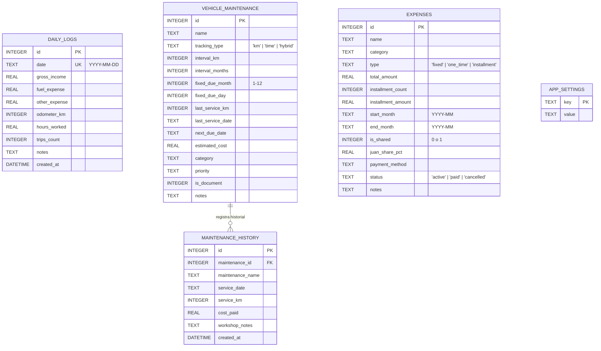
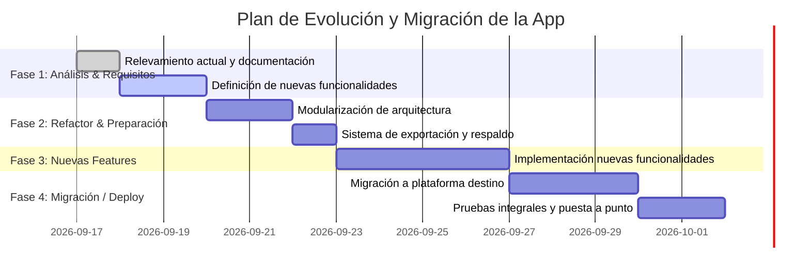

# 📊 Informe Técnico Integral: Análisis y Plan de Mejora — App Gastos & Gestión de Vehículo

**Fecha de Relevamiento:** 2026-09-17  
**Elaborado por:** Project Manager & Equipo de Arquitectura y Desarrollo  
**Estado:** Relevamiento inicial completado • En espera de especificaciones de migración y nuevas funcionalidades

---

## 🎯 1. Resumen Ejecutivo y Alcance

Se ha realizado una auditoría y análisis exhaustivo de la base de código de **`app-gastos`** (React 18 + Vite + Express + SQLite). La aplicación actualmente resuelve de forma muy completa y funcional el control de gastos, cálculo de cuotas proyectadas a 12 meses, registro de jornadas diarias de chofer (Uber/Logística), mantenimiento vehicular dual (kilometraje y tiempo/vencimientos) y el termómetro de metas financieras mensuales.

Este documento consolida:
1. **Relevamiento arquitectónico y funcional actual.**
2. **Diagnóstico de fortalezas y oportunidades de mejora.**
3. **Plan de trabajo por fases** para reestructurar, optimizar y preparar la aplicación para su migración y la incorporación de las nuevas funcionalidades solicitadas por el desarrollador.

---

## 🏗️ 2. Arquitectura y Componentes Actuales

### 2.1. Stack Tecnológico
* **Frontend:** React 18.3, Vite 5.4, Vanilla CSS (tema oscuro con variables CSS custom), Lucide React (iconos), Canvas-Confetti.
* **Backend:** Node.js ESM con Express 4.21, `better-sqlite3` en modo WAL (Write-Ahead Logging), CORS.
* **Base de Datos:** SQLite (`gastos.db`) con 5 entidades principales.

### 2.2. Modelo de Datos (`gastos.db`)

### 2.3. Módulos Funcionales Existentes

1. **Dashboard Financiero (`src/views/Dashboard.jsx`)**:
   - KPIs de Ganancia Neta, Obligaciones del Mes, Balance Neto vs Gastos, Fondo de Repuestos.
   - Termómetro de Metas (`GoalThermometer.jsx`) con metas Mínima (obligaciones), Esperada (+ fondo auto y ahorro) y cálculo de ritmo diario necesario.
   - Listado de próximos services urgentes y compras en cuotas activas.
2. **Registro de Jornadas Uber (`src/views/DailyTracker.jsx`)**:
   - Facturación bruta, combustible (GNC/Nafta), gastos menores, cálculo automático de ganancia neta.
   - Odómetro diario con cálculo automático de km recorridos en la jornada y ganancia neta por hora.
3. **Mantenimiento y Trámites Vehiculares (`src/views/VehiclePage.jsx`)**:
   - Control triple: por Kilometraje (ej. pastillas 25.000 km), por Tiempo (ej. VTV anual, Oblea GNC anual, Patente bimestral, Prueba Hidráulica 5 años) e Híbrido (Aceite cada 10.000 km o 1 año).
   - Cálculo automático de fondo de provisión acumulado según desgaste.
   - Historial de services realizados.
   - Módulo de regularización y plan de cuotas para deuda de patente.
4. **Control de Gastos y Cuotas Sin Interés (`src/views/ExpensesPage.jsx`)**:
   - CRUD completo de gastos fijos, puntuales y cuotas.
   - Proyección dinámica mes a mes a 12 meses vista (`/api/expenses/projections`).
   - División de gastos compartidos del hogar (% Juan vs % Yeli).

---

## 🔍 3. Diagnóstico y Hallazgos: ¿Qué Podemos Mejorar?

A continuación se detallan las áreas clave de mejora clasificadas por disciplina:

### 3.1. ⚙️ Backend & API
1. **Desacoplamiento y Modularización de Rutas**:
   - Actualmente `server/routes.js` tiene 942 líneas que concentran toda la lógica de negocio, cálculos matemáticos, queries SQL y controladores.
   - **Mejora:** Separar en capas: `controllers/`, `services/` (ej. `FinancialSummaryService`, `InstallmentProjectionService`, `VehicleMaintenanceService`) y `routes/`.
2. **Eliminación de Valores Hardcodeados**:
   - En el cálculo de metas (`/api/summary`) están fijos valores como `$100.000` de provisión base y `$100.000` de ahorro adicional, así como nombres y porcentajes prefijados.
   - **Mejora:** Mover estos parámetros a la tabla `app_settings` para que sean 100% editables desde una pantalla de Configuración / Perfil.
3. **Transaccionalidad en Operaciones Críticas**:
   - Cuando se registra un service hecho (`service-done`), se actualiza `vehicle_maintenance`, se inserta en `maintenance_history` y se actualiza el odómetro en `app_settings` sin un bloque de transacción `db.transaction()`.
   - **Mejora:** Envolver operaciones compuestas en transacciones atómicas para garantizar integridad.
4. **Validación y Sanitización de Payloads**:
   - No hay validación estricta de esquemas ni tipos en los endpoints POST/PUT.
   - **Mejora:** Implementar middleware de validación para evitar números negativos, strings vacíos o formatos de fecha erróneos.

### 3.2. 🎨 Frontend & UX/UI
1. **Gestión de Estado y Single Source of Truth (SSOT)**:
   - Hay lógica de cálculo de vencimientos (`computeItemMetrics`) duplicada tanto en `server/routes.js` como en `Dashboard.jsx` y `VehiclePage.jsx`. Si una regla cambia, genera inconsistencias.
   - **Mejora:** Centralizar todos los cálculos en el backend y consumirlos directamente en el cliente.
   - Reemplazar el *prop drilling* excesivo en `App.jsx` por Custom Hooks (`useExpenses`, `useVehicle`, `useDailyLogs`) o React Context.
2. **Sistema de Notificaciones / Feedback Visual**:
   - La app utiliza `alert()` o `window.confirm()` nativos del navegador.
   - **Mejora:** Incorporar toasts elegantes (Toaster) y modales de confirmación personalizados.
3. **Optimización Mobile First**:
   - Dado que el usuario registra cargas de combustible, jornadas o gastos desde el teléfono, se requiere optimizar los modales con teclados numéricos directos (`inputMode="decimal"`), botones de acción rápida tipo FAB (Floating Action Button) y navegación inferior táctil en pantallas chicas.
4. **Módulo de Analítica y Estadísticas Gráficas**:
   - Falta una vista gráfica (ej. con Chart.js o Recharts) que muestre:
     - Curva de ingresos vs combustible mensual.
     - Comparativa de gastos por categoría (gráfico de dona / torta).
     - Evolución del odómetro y km promedio por día.

### 3.3. 🗄️ Base de Datos, Respaldos & Migrabilidad
1. **Respaldo y Exportación de Datos**:
   - No existe mecanismo para exportar a Excel / CSV o descargar un JSON de respaldo de la base de datos.
   - **Mejora:** Crear endpoints `/api/export/excel` y `/api/export/backup-json`, más un importador para restauración inmediata.
2. **Preparación para Migración a PostgreSQL 17 / Laravel 12 (si aplica)**:
   - Si el destino final de la app es integrarse al ecosistema Laravel 12 + PostgreSQL 17 del proyecto base (`app-norte2.0`):
     - Mapeo directo de tablas a migraciones estándar de Laravel.
     - Modelos Eloquent con relaciones (`VehicleMaintenance hasMany MaintenanceHistory`).
     - Creación de Commands y Scheduler para alertas automáticas de vencimiento.

---

## 🗺️ 4. Plan de Trabajo Propuesto

### Etapa 1 — Definición del Destino y Nuevos Requerimientos (Actual)
* Esperar el detalle del desarrollador sobre:
  1. Hacia qué entorno o stack se moverá la aplicación (¿Laravel 12 + Blade/Postgres, Cloud, PWA, etc.?).
  2. Cuáles son las nuevas funcionalidades específicas a incorporar.
  3. Qué modificaciones aplican sobre los módulos actuales.

### Etapa 2 — Refactorización y Blindaje de Datos
* Implementar sistema de exportación y respaldo de datos actual (`gastos.db` -> JSON / CSV) para garantizar 0% pérdida de información.
* Desacoplar reglas de negocio en servicios modulares independientes del framework.

### Etapa 3 — Desarrollo de Nuevas Funcionalidades
* Diseñar la base de datos y endpoints para las nuevas características.
* Construir interfaces UX/UI consistentes con la estética premium actual.

### Etapa 4 — Validación, Testing y Entrega
* Pruebas de consistencia financiera (cuotas, cálculos de gastos compartidos, semáforo de kilometraje y vencimientos).
* Verificación cruzada con los especialistas de Seguridad, Testing y UX/UI.

---

## 📌 5. Estado y Próximos Pasos

> [!NOTE]
> Este reporte técnico ha quedado guardado en `Docs/analisis_y_plan_mejora_app_gastos.md` en la carpeta raíz del proyecto para preservar toda la información histórica y técnica.

**Preguntas para el desarrollador antes de dar el siguiente paso:**
1. ¿A qué plataforma, framework o infraestructura vamos a mover la aplicación?
2. ¿Cuáles son las modificaciones puntuales que querés hacerle a lo existente?
3. ¿Cuáles son las nuevas funcionalidades a desarrollar?
