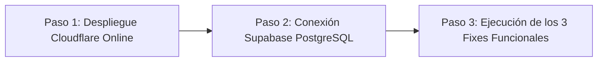

# 📌 Estado Actual del Proyecto, Arquitectura y Bitácora de Modificaciones

**Última actualización:** 2026-09-24  
**Proyecto:** AutoGastos SaaS (App Norte 2.0)  
**Entorno de Producción:** Cloudflare Workers (OpenNext) + Supabase PostgreSQL  
**Repositorios / Workspaces:** `c:\Users\user\Desktop\app-norte2.0` / `c:\Users\user\Desktop\app-gastos`  
**Estado General:** Fases 1, 2, 3 y 4 (Setup Cloudflare/Supabase, Telegram/Validaciones/Odómetro, Gobernanza SaaS de Módulos, Adelantos & Conciliación de Caja) ✅ 100% COMPLETADAS. Builds Next.js y Cloudflare ✅ Exitosos (código 0). Listo para despliegue final y vinculación de base de datos en producción.

---

## 🎯 1. Resumen Ejecutivo del Negocio

**AutoGastos SaaS** es una solución web integral y multi-tenant orientada a choferes de movilidad y logística urbana (Uber, Cabify, DiDi, InDrive, Rappi, PedidosYa) y gestión de finanzas compartidas del hogar en Argentina.

### Capacidades Clave
1. **Control de Jornadas Multiapp:** Registro diario con desglose por aplicación, cálculo de minutos exactos trabajados (`minutes_worked`, ej. `5h 47m`), combustible, odómetro y rendimiento neto en tiempo real en pesos por hora (`$/h`).
2. **Finanzas Personales & Hogar Compartido:** Gestión de gastos fijos y compras en cuotas con proyección a 12 meses vista, checklist interactivo mensual de pagos cancelados vs pendientes y división porcentual automática en parejas/familias (ej. 60% Juan / 40% Yeli) sin duplicar datos.
3. **Mantenimiento Vehicular Preventivo:** Semáforos preventivos adaptados para **Auto Propio** (control dual por kilometraje y tiempo para VTV, GNC, Patente y services mecánicos con fondo de reserva de $100.000/mes) o **Auto Alquilado** (canon periódico de alquiler).
4. **Termómetro Financiero:** Enfoque visual de metas mensuales en el Dashboard: punto de equilibrio básico vs meta esperada de rentabilidad.
5. **Automatización & Bot de Telegram:** Notificaciones diarias/mensuales, comandos interactivos (`/resumen`, `/jornada`, `/pagos`, `/chatid`), sincronización vía webhook y alertas mecánicas según días de anticipación elegidos por cada usuario.
6. **Panel de Administración:** Control SaaS con métricas globales y Feature Flags por chofer para activar o restringir módulos de forma independiente.

---

## 💻 2. Stack Tecnológico & Infraestructura

| Capa | Tecnología | Versión / Detalle | Justificación |
|---|---|---|---|
| **Framework Fullstack** | Next.js (App Router, Turbopack) | `16.3.5` | SSR eficiente, server actions y soporte de rutas API dinámicas. |
| **Biblioteca UI** | React | `19.3.0` | Hooks modernos, concurrencia y alto rendimiento en interfaz. |
| **Estilos & Apariencia** | CSS Vanilla (Design System) + Lucide Icons | N/A | Total control de rendimiento, microinteracciones y modo Dark/Light nativo con persistencia. |
| **ORM & Modelado** | Drizzle ORM + Drizzle Kit | `0.38.3` / `0.30.1` | Tipado TypeScript/JS estricto, queries SQL livianas y migraciones determinísticas. |
| **Base de Datos** | PostgreSQL (Supabase) | 16+ / 17 | Base de datos relacional robusta con connection pooling (Transaction Pooler en puerto 6543 / Session en 5432). |
| **Edge & Despliegue** | Cloudflare Workers (`@opennextjs/cloudflare`) | `1.20.6` | Despliegue global serverless en edge, baja latencia y bajo costo de mantenimiento. |
| **CLI de Despliegue** | Wrangler | `4.135.0` (`nodejs_compat`, `compatibility_date: 2025-01-01`) | Herramienta oficial de Cloudflare para workers y bindings. |
| **Autenticación** | JWT (`jose`) + `bcryptjs` + Google OAuth 2.0 | `jose@5.9.6`, `bcryptjs@2.4.3` | Sesiones en cookies `httpOnly`, criptografía Web Crypto nativa compatible con Cloudflare Workers. |
| **Validación de Datos** | Zod | `3.24.1` | Validación estricta en esquemas de entrada de API con mensajes explícitos en español. |

---

## 🗄️ 3. Modelo de Datos (PostgreSQL / Drizzle Schema)

Esquema ubicado en [`src/db/schema.js`](file:///c:/Users/user/Desktop/app-norte2.0/src/db/schema.js):

1. **`users`:** Suscriptor SaaS, email, hash bcrypt, rol (`admin` | `user`), Google OAuth ID/avatar, modalidad (`owner` | `renter`), apps activas en JSON, feature flags (`moduleDriver`, `moduleExpenses`, `moduleVehicle`), tema (`dark` | `light`), Telegram chat ID, anticipación de alertas y estado de suscripción (`trial`, `active`, `suspended`).
2. **`households` & `household_members`:** Grupos familiares/parejas con porcentajes de división asignados (ej. 60.00 / 40.00) y estados de invitación (`pending`, `accepted`).
3. **`daily_logs`:** Registro diario por chofer (`userId` + `date` único), ingreso bruto, desglose JSON por app, combustible, otros gastos, odómetro, minutos totales trabajados (`minutes_worked`) y cantidad de viajes.
4. **`vehicle_maintenance` & `maintenance_history`:** Tareas preventivas con seguimiento por km, por tiempo o híbrido, vencimientos fijos de patente/GNC, último service y registro histórico de gastos en talleres.
5. **`expenses`:** Gastos fijos, compras en cuotas o únicos, mes inicio/fin, día de vencimiento, método de pago, vinculación a hogar compartido y porcentaje de imputación.
6. **`expense_payments`:** Checklist interactivo mensual (`expenseId` + `userId` + `month` único) para registrar qué cuotas ya fueron desembolsadas en el mes corriente.
7. **`user_settings`:** Almacenamiento clave-valor de configuración personalizada por usuario (ej. `current_odometer`).

---

## 🛠️ 4. Bitácora Técnica de Modificaciones & Fixes Realizados

Esta sección detalla cada problema técnico encontrado durante el ciclo de desarrollo y cómo fue resuelto para garantizar que cualquier desarrollador o sistema de IA comprenda el estado del código.

### 🔴 Fix Crítico #1: Error de Empaquetado Cloudflare (`pg-cloudflare`)
- **Síntoma / Error:**  
  Al ejecutar `npm run build:cloudflare` (`opennextjs-cloudflare build`), el proceso fallaba en el paso de esbuild con:  
  `✘ [ERROR] Could not resolve "pg-cloudflare"`  
  `The module "./dist/index.js" was not found on the file system: .open-next/server-functions/default/node_modules/pg-cloudflare/package.json:16:19`
- **Causa Raíz:**  
  La librería `pg` (node-postgres) incluye un `require('pg-cloudflare')` condicional en tiempo de ejecución. El trazador de archivos de Next.js (`@vercel/nft`) detectaba el paquete pero únicamente copiaba `package.json` a la carpeta temporal de la función del servidor, omitiendo los binarios compilados en `dist/`.
- **Solución Aplicada:**
  1. En [`next.config.mjs`](file:///c:/Users/user/Desktop/app-norte2.0/next.config.mjs), se configuró `outputFileTracingIncludes` para forzar la inclusión completa del paquete:
     ```javascript
     outputFileTracingIncludes: {
       '**/*': [
         './node_modules/pg-cloudflare/**/*',
       ],
     }
     ```
  2. En [`package.json`](file:///c:/Users/user/Desktop/app-norte2.0/package.json) y [`package-lock.json`](file:///c:/Users/user/Desktop/app-norte2.0/package-lock.json), se agregó `"pg-cloudflare": "^1.1.1"` como dependencia directa de producción para que `npm ci` en los runners de Cloudflare lo instale con certeza.
  3. En [`wrangler.jsonc`](file:///c:/Users/user/Desktop/app-norte2.0/wrangler.jsonc), se actualizó `compatibility_date` a `"2025-01-01"` y se preservó `nodejs_compat`.
- **Resultado:** Compilación 100% exitosa (`Worker saved in .open-next\worker.js 🚀`, exit code 0).

### 🟢 Fix / Mejora #2: Precisión de Jornadas en Minutos Exactos
- **Problema:** En versiones anteriores se guardaban horas decimales (ej. 5.75 horas), lo cual provocaba desajustes en el cálculo de rendimiento $/h y confusión en el chofer al cargar jornadas como `5h 47m`.
- **Solución:** Se estandarizó la columna `minutes_worked` (entero) en la base de datos y se actualizó el modal [`DailyLogModal.jsx`](file:///c:/Users/user/Desktop/app-norte2.0/src/components/DailyLogModal.jsx) para ingresar Horas y Minutos por separado, convirtiéndolos de forma exacta.

### 🟢 Fix / Mejora #3: Seguridad en Google OAuth & Cuentas Administrativas
- **Problema:** Riesgo de escalamiento de privilegios o sobreescritura accidental si un usuario iniciaba sesión con Google usando el correo institucional de administración.
- **Solución:** Se implementó una regla estricta en [`src/app/api/auth/google/callback/route.js`](file:///c:/Users/user/Desktop/app-norte2.0/src/app/api/auth/google/callback/route.js) que bloquea el login social para la cuenta Admin (`admin@autogastos.com`), obligándola a autenticarse exclusivamente con credenciales autóctonas y hash bcrypt. Los usuarios normales creados vía Google se aprovisionan de forma segura con `role: 'user'` y catálogo de servicios vehiculares precargado.

### 🟢 Fix / Mejora #4: Aumentos de Gastos con Preservación Histórica
- **Problema:** Si un alquiler o servicio aumentaba en marzo, modificar el valor del gasto alteraba retrospectivamente los resúmenes financieros de enero y febrero.
- **Solución:** Se diseñó el endpoint `/api/expenses/[id]/increase` y el componente [`IncreaseModal.jsx`](file:///c:/Users/user/Desktop/app-norte2.0/src/components/IncreaseModal.jsx). Este flujo cierra la vigencia del período anterior en el mes inmediatamente anterior al aumento (`endMonth`) y crea un nuevo registro con el monto actualizado a partir del mes indicado (`effectiveMonth`), conservando inalterados los datos históricos.

### 🟢 Fix / Mejora #5: Checklist de Pagos Mensuales (Flujo de Caja)
- **Problema:** No existía forma de distinguir entre un gasto presupuestado/proyectado y un gasto efectivamente cancelado durante el transcurso del mes.
- **Solución:** Se incorporó la tabla `expense_payments` y los endpoints `/api/expenses/payments`. La UI de `/expenses` y el reporte de Telegram ahora muestran el desglose en 3 niveles: *Total Obligaciones*, *✅ Ya Cancelado* y *⏳ Pendiente por Desembolsar*.

---

## 🗺️ 5. Hoja de Ruta Inmediata (Roadmap de Trabajo)

Siguiendo las instrucciones del desarrollador, el trabajo se estructura en tres fases estrictamente secuenciales:



### Paso 1: Despliegue en Cloudflare (Online)
- Subir los cambios a GitHub (`master`) y verificar que el build en Cloudflare Pages / Workers finalice sin errores de `pg-cloudflare`.
- Confirmar que la aplicación renderiza sus vistas estáticas públicas (`/`, `/login`, `/register`).

### Paso 2: Conexión con Base de Datos en Supabase
- Obtener la cadena de conexión de Supabase (Connection Pooling en puerto 6543 para Serverless o Session en 5432).
- Configurar `DATABASE_URL` y variables sensibles en el panel de Cloudflare (`JWT_SECRET`, `TELEGRAM_BOT_TOKEN`, `CRON_SECRET`).
- Aplicar las migraciones del esquema con `drizzle-kit push` o `npm run db:migrate`.
- Ejecutar el seed inicial para el administrador y usuario demo.

### Paso 3: Estado de Ejecución de Fixes Funcionales (Ver Plan Maestro: Docs/plan_de_trabajo_fixes_y_conciliacion.md)

- ✅ **Fix A (Validaciones en todo el sistema):** Esquema Zod unificado en [src/lib/validations.js](file:///c:/Users/user/Desktop/app-norte2.0/src/lib/validations.js) para aceptar minutos acumulados y mensajes de error humanos e intuitivos en todos los modales.
- ✅ **Fix B (Parser Telegram /jornada, Notas y comando /gasto):** Resuelto el bug de inversión de horas/viajes con parser línea por línea en [src/app/api/telegram/webhook/route.js](file:///c:/Users/user/Desktop/app-norte2.0/src/app/api/telegram/webhook/route.js). Incorporada captura de observaciones (`notas: ...`) y nuevo comando interactivo `/gasto`.
- ✅ **Fix Crítico de Odómetro (Retroceso automático al eliminar/editar jornada):** Implementado [src/lib/odometer.js](file:///c:/Users/user/Desktop/app-norte2.0/src/lib/odometer.js) con `syncUserOdometer()`. Al borrar o editar una jornada hacia abajo, el odómetro general del auto retrocede al valor real de las jornadas y services restantes, evitando distorsiones en los semáforos de VTV/GNC/Aceite.
- ✅ **Fase 3 (Gobernanza SaaS de Módulos - Feature Flags):** Restricción de acceso en profundidad (Edge Middleware, Guards React en cliente, Navbar dinámico, Banner explicativo en Dashboard). Solo el Administrador puede activar/desactivar `moduleDriver`, `moduleExpenses` y `moduleVehicle`. La API `/api/user/profile` bloquea modificaciones no autorizadas de módulos.
- ✅ **Fase 4 (Fix C - Adelantos y Arqueo / Conciliación de Caja):** Modelo de extracciones y retiros inmediatos de Uber/Cabify sin distorsionar facturación de apps, comando `/adelanto` en Telegram Bot, módulo interactivo de Arqueo y Conciliación de Caja (Realidad vs Sistema) con blanqueo automático por gastos no anotados o ajustes directos de ritmo diario.
- ✅ **Sesión de Pruebas Operativas (Bugs menores corregidos):** Resuelto error de React Hooks en `GoalThermometer`, normalizadas las tarjetas de liquidación para que solo muestren las apps configuradas por el usuario (`user.activeApps`) y conectado el monto de `appBreakdownTotals` en la respuesta JSON de `/api/summary`.
- 🎯 **Siguiente Paso:** Despliegue en la nube y puesta en marcha de producción con Supabase + Cloudflare Workers.
