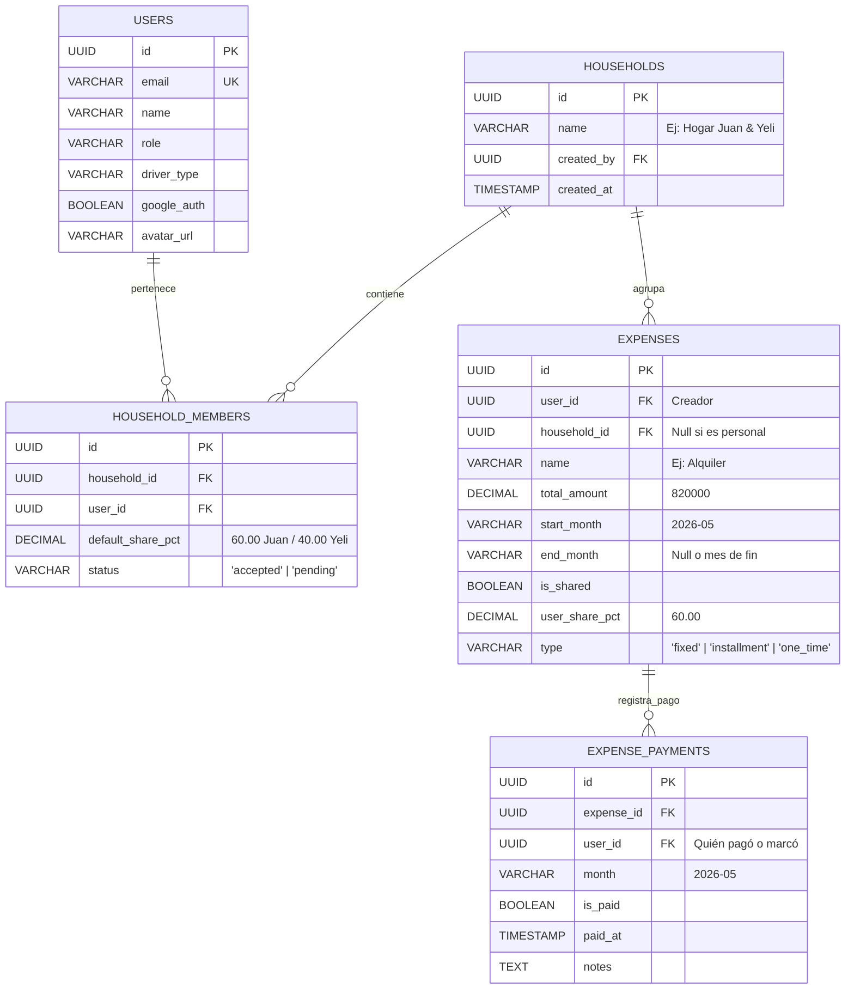

# Plan de Implementación: Suite de Finanzas Avanzadas, Hogar Compartido y Google OAuth

Este plan integra las 4 funcionalidades estratégicas solicitadas para **AutoGastos SaaS**:

1. **🔐 Login y Registro con Google (Gmail OAuth 2.0 & OpenID Connect):** Acceso en 1 clic con auto-completado de perfil y auto-aprovisionamiento de catálogo.
2. **🏡 Módulo de Hogar Compartido & Cuentas Vinculadas (*Household Split*):** Juan (60%) y Yeli (40%) compartiendo gastos comunes sin duplicar registros, manteniendo gastos personales 100% privados.
3. **📈 Aumentos de Alquiler y Servicios con Vigencia Temporal:** Ajustes de precios (ICL/IPC) a futuro sin alterar los meses históricos.
4. **✅ Checklist de Cuentas Pagadas en el Mes (*Monthly Payment Tracker*):** Tildar qué cuentas ya fueron canceladas en el mes con tracking de *Ya Pagado* vs *Pendiente por Pagar* en Dashboard y Telegram.

---

## 🏗️ 1. Arquitectura de Base de Datos (PostgreSQL & Drizzle ORM)



---

## 📂 Detalle de Cambios por Componente

### 1. Base de Datos & Modelos
#### [MODIFY] [`src/db/schema.js`](file:///c:/Users/user/Desktop/app-norte2.0/src/db/schema.js)
- Agregar tablas `households`, `householdMembers`, y `expensePayments`.
- Agregar `householdId` en la tabla `expenses`.
- Agregar `avatarUrl` y `googleId` en la tabla `users`.

---

### 2. Autenticación con Google (Gmail OAuth 2.0)
- **Seguridad de Cuenta Administrador:** La cuenta Administrador (`role: 'admin'`) es **100% autóctona/nativa** de la aplicación (ingreso exclusivo por correo y contraseña con hash bcrypt). Todo login por Google asigna estrictamente el rol `user` para proteger los accesos administrativos del SaaS.
#### [NEW] [`src/lib/google-auth.js`](file:///c:/Users/user/Desktop/app-norte2.0/src/lib/google-auth.js)
- Cliente OAuth 2.0 con endpoints oficiales de Google (`/o/oauth2/v2/auth`, `/oauth2/v2/userinfo`).
- Modo de simulación en desarrollo local si las claves no están cargadas.

#### [NEW] [`src/app/api/auth/google/route.js`](file:///c:/Users/user/Desktop/app-norte2.0/src/app/api/auth/google/route.js) y [`src/app/api/auth/google/callback/route.js`](file:///c:/Users/user/Desktop/app-norte2.0/src/app/api/auth/google/callback/route.js)
- Redirección y recepción de callback.
- Auto-creación de usuario en PostgreSQL con rol `user` si entra por primera vez y precarga del catálogo de mantenimientos.
- Emisión de cookie segura `autogastos_session`.

#### [MODIFY] [`src/app/login/page.jsx`](file:///c:/Users/user/Desktop/app-norte2.0/src/app/login/page.jsx) y [`src/app/register/page.jsx`](file:///c:/Users/user/Desktop/app-norte2.0/src/app/register/page.jsx)
- Botón premium con isotipo oficial de Google *"Continuar con Google"* para choferes/usuarios, manteniendo el formulario clásico nativo de Correo/Contraseña para el Administrador y cuentas nativas.

---

### 3. Módulo de Hogar Compartido (Cuentas Vinculadas Juan 60% / Yeli 40%)
#### [NEW] [`src/app/api/household/route.js`](file:///c:/Users/user/Desktop/app-norte2.0/src/app/api/household/route.js) y [`src/app/api/household/accept/route.js`](file:///c:/Users/user/Desktop/app-norte2.0/src/app/api/household/accept/route.js)
- Endpoints para crear hogar, enviar invitación por email a la pareja, aceptar vinculación y configurar porcentajes por defecto (60/40).

#### [MODIFY] [`src/lib/summary.js`](file:///c:/Users/user/Desktop/app-norte2.0/src/lib/summary.js)
- Cálculo inteligente de gastos: si un gasto pertenece al `householdId`, calcula la porción proporcional correspondiente al usuario en sesión sin duplicar datos en base de datos.

#### [MODIFY] [`src/app/settings/page.jsx`](file:///c:/Users/user/Desktop/app-norte2.0/src/app/settings/page.jsx)
- Nueva sección interactiva: **"🏡 Hogar & Cuentas Vinculadas"** con formulario de invitación, estado de aceptación y selector de porcentajes compartidos.

---

### 4. Aumentos Escalonados de Alquiler con Vigencia Histórica
#### [NEW] [`src/app/api/expenses/[id]/increase/route.js`](file:///c:/Users/user/Desktop/app-norte2.0/src/app/api/expenses/[id]/increase/route.js)
- Permite aplicar aumentos (ej. Alquiler pasa de $600.000 a $820.000 a partir de Mayo):
  - Cierra la vigencia anterior en Abril (`endMonth = '2026-04'`).
  - Crea el registro con el nuevo monto desde Mayo en adelante (`startMonth = '2026-05'`).
  - Protege el historial de Enero a Abril sin sobreescribirlo.

#### [MODIFY] [`src/components/ExpenseModal.jsx`](file:///c:/Users/user/Desktop/app-norte2.0/src/components/ExpenseModal.jsx)
- Modal mejorado con opción *"Aplicar Aumento / Actualización de Precio desde este mes"*.

---

### 5. Checklist de Pagos Mensuales (Pagado vs Pendiente)
#### [NEW] [`src/app/api/expenses/payments/route.js`](file:///c:/Users/user/Desktop/app-norte2.0/src/app/api/expenses/payments/route.js)
- Endpoint GET/POST para consultar y alternar el estado de pago (`[✓] Pagado` / `[ ] Pendiente`) de un gasto en el mes seleccionado.

#### [MODIFY] [`src/app/expenses/page.jsx`](file:///c:/Users/user/Desktop/app-norte2.0/src/app/expenses/page.jsx)
- Checkbox interactivo en cada fila de la tabla de gastos.
- Barra superior de flujo de caja mensual:
  - **Total a Cubrir:** $468.500
  - **✅ Ya Cancelado:** $380.000 (81%)
  - **⏳ Pendiente de Desembolso:** $88.500 (19%)

#### [MODIFY] [`src/app/dashboard/page.jsx`](file:///c:/Users/user/Desktop/app-norte2.0/src/app/dashboard/page.jsx)
- Widget visual de estado de pagos del mes.

#### [MODIFY] [`src/lib/telegram.js`](file:///c:/Users/user/Desktop/app-norte2.0/src/lib/telegram.js)
- Integrar en los reportes automáticos el detalle de qué cuentas ya se pagaron y cuánto queda pendiente por desembolsar.

---

## 🧪 Verification Plan

### Automated & Database Migration Tests
1. Ejecutar migración de base de datos en PostgreSQL local:
   ```bash
   npm run db:migrate
   ```
2. Compilar toda la aplicación:
   ```bash
   npm run build
   ```

### Manual Verification
1. **Prueba Google OAuth:** Entrar a `/login`, pulsar "Continuar con Google" y verificar login fluido y creación de cuenta.
2. **Prueba Hogar Compartido:** Desde la cuenta de Juan invitar a `yeli@correo.com` (60%/40%), registrar o iniciar sesión con Yeli, aceptar invitación y cargar el alquiler compartido de $820.000. Verificar que en Juan sume $492.000 y en Yeli $328.000.
3. **Prueba Aumento de Alquiler:** Aplicar un aumento desde el mes actual y verificar que los meses anteriores sigan mostrando el valor previo.
4. **Prueba Checklist de Pagos:** Tildar el alquiler como pagado, verificar que la barra de progreso de desembolsos se actualice al instante y que el bot de Telegram refleje el pago.
