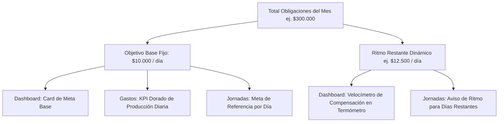
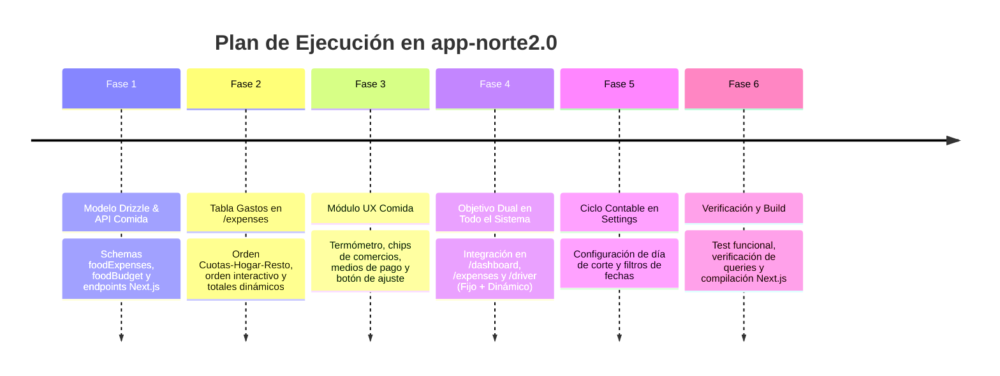

# 📋 Plan de Trabajo Integral: Módulo de Comida Flexible, Orden & Totales de Gastos y Reingeniería de Objetivo Diario Dual

**Fecha:** 2026-10-08 (rev. final)  
**Elaborado por:** Project Manager (@pm) & Equipo Técnico Especializado (Backend, Frontend, UX/UI, Base de Datos, Arquitectura)  
**Proyecto:** AutoGastos SaaS (**`app-norte2.0`**)  
**Stack de Destino:** Next.js 16 (App Router) · React 19 · PostgreSQL (Supabase) + Drizzle ORM · Cloudflare Workers (OpenNext) · CSS Vanilla  
**Estado:** ✅ **IMPLEMENTADO Y VALIDADO AL 100%** (Build limpia con Turbopack exit code 0)

---

## 🎯 1. Resumen Ejecutivo y Alcance Exclusivo para `app-norte2.0`

A partir de la directiva expresa del desarrollador, **este plan y todas las implementaciones posteriores aplican de manera exclusiva al repositorio `c:\Users\user\Desktop\app-norte2.0`**.

Se abordan 4 ejes funcionales y de experiencia de usuario:

1. **Ampliación Integral del Rubro de Comida / Supermercado:**
   - Soporte a los 3 modos de compra: presupuesto tope mensual opcional, registro ticket a ticket (Jumbo, Día, Pigmento, Coto, verdulería, carnicería, etc.), medios de pago (Efectivo, Débito, TDC VISA / MasterCard) y control de desvíos en caliente (alertas de proximidad o exceso con recalibración en 1 clic).
2. **Reorganización y Totales Dinámicos en la Tabla de Gastos Activos (`/expenses`):**
   - Jerarquía visual por defecto: **1° Compras en Cuotas**, **2° Gastos del Hogar**, **3° Resto de Gastos**.
   - Totales contextuales por filtro: pie de tabla (`<tfoot>`) y barra resumen con sumatorias brutas y correspondientes al usuario según lo filtrado (si filtro cuotas, total cuotas; si filtro hogar, total hogar).
   - Ordenamiento interactivo por columnas (clic en encabezados: monto, concepto, cuotas).
3. **Sistema Dual de Objetivo Diario (Fijo de Planificación + Dinámico de Compensación):**
   - **Objetivo Diario Base (Fijo):** $Total Obligaciones / Días del Mes o Ciclo$. Es el valor de referencia mental que se mantiene constante de inicio a fin de mes (solo varía si se agregan, modifican o borran gastos).
   - **Ritmo Diario Restante (Dinámico):** $(Meta - Ganancia Acumulada) / Días Restantes$. Se recalcula día a día; si un día no se sale o se gana menos, se ajusta hacia arriba para compensar, y si un día se gana mucho, se relaja.
   - Sincronización en las 3 vistas clave: **Dashboard (`/dashboard`)**, **Gastos (`/expenses`)** y **Jornadas Chofer (`/driver`)**.
4. **Ciclo Contable / Facturación Personalizado:**
   - Permitir al usuario definir cuándo comienza y cuándo termina su mes financiero (ej. del 10 al 9 del mes siguiente o calendario tradicional del 1 al 31) mediante `billing_cycle_start_day` en `users` o `user_settings`.

---

## 🔍 2. Arquitectura del Sistema Dual de Objetivo Diario

### Comparativa Conceptual de las Dos Métricas:

| Característica | 📌 Objetivo Diario Base (Fijo) | ⚡ Ritmo Diario Restante (Dinámico) |
|---|---|---|
| **Fórmula** | $\frac{\text{Total Obligaciones del Mes}}{\text{Días Totales del Ciclo (ej. 30)}}$ | $\frac{\max(0, \text{Meta} - \text{Ganancia Neta Acumulada})}{\text{Días Restantes del Ciclo}}$ |
| **Comportamiento** | **Estable y predecible:** no fluctúa según el trabajo de ayer. Solo cambia si se añaden/quitan gastos. | **Adaptativo:** aumenta si un día no trabajas; disminuye si tienes un día récord. |
| **Finalidad Psicológica** | El número de referencia mental diario que siempre tienes en mente. | El velocímetro táctico para saber a qué ritmo compensar lo que resta del mes. |
| **Impacto de Pagos** | No se altera al marcar gastos como pagados (pagar es salida de caja, no cambia la producción necesaria). | No se altera por pagos; solo por la ganancia neta acumulada en jornadas. |

### Visualización Coordinada en la Interfaz:



* **En `/dashboard`:**
  - KPI de Cabecera: **`$XX.XXX / día base`** *(Meta mensual planificada)*.
  - Termómetro: acompaña con el **`Ritmo restante: $YY.YYY / día`** *(para compensar días restantes)*.
* **En `/expenses`:**
  - Tarjeta KPI dorada: **`Meta Diaria de Producción: $XX.XXX / día`**. Permite al usuario entender cuánto le exige la lista de gastos por cada día del período.
* **En `/driver`:**
  - KPI Header: muestra ambos valores: **`Meta Base: $XX.XXX / día`** y **`Ritmo Necesario: $YY.YYY / día`**.
  - Tabla de Jornadas: cada jornada tiene un semáforo respecto al objetivo base (🟢 superó meta base, 🟡 cerca de la meta, 🔴 por debajo).

---

## 🍽️ 3. Módulo de Comida y Supermercado en `app-norte2.0`

### 3.1. Tres Modos de Operación
1. **Solo Presupuesto Global:** Asignas un monto estimado mensual (ej. $\$600.000$).
2. **Solo Registro Ticket a Ticket:** No defines techo; vas cargando compras reales (Jumbo, Día, Pigmento, etc.).
3. **Híbrido (Recomendado):** Fijas presupuesto (\$600.000) y registras los tickets individuales.

### 3.2. Modelo de Datos en PostgreSQL (`src/db/schema.js`)

Se crearán las tablas en Drizzle ORM para PostgreSQL:

```javascript
// 12. GASTOS DETALLADOS DE COMIDA / SUPERMERCADO
export const foodExpenses = pgTable('food_expenses', {
  id: uuid('id').defaultRandom().primaryKey(),
  userId: uuid('user_id').references(() => users.id, { onDelete: 'cascade' }).notNull(),
  householdId: uuid('household_id').references(() => households.id, { onDelete: 'set null' }),
  month: varchar('month', { length: 7 }).notNull(), // 'YYYY-MM'
  storeName: varchar('store_name', { length: 150 }).notNull(), // 'Jumbo', 'Día', 'Pigmento', 'Coto', etc.
  amount: numeric('amount', { precision: 12, scale: 2 }).notNull(),
  date: varchar('date', { length: 10 }).notNull(), // 'YYYY-MM-DD'
  paymentMethod: varchar('payment_method', { length: 50 }).default('Efectivo').notNull(), // 'Efectivo' | 'Débito' | 'VISA' | 'MASTER'
  isShared: boolean('is_shared').default(true).notNull(),
  userSharePct: numeric('user_share_pct', { precision: 5, scale: 2 }).default('60.00').notNull(),
  notes: text('notes'),
  createdAt: timestamp('created_at').defaultNow().notNull(),
  updatedAt: timestamp('updated_at').defaultNow().notNull(),
});

// 13. CONFIGURACIÓN DE PRESUPUESTO MENSUAL DE COMIDA
export const foodBudgetSettings = pgTable('food_budget_settings', {
  id: uuid('id').defaultRandom().primaryKey(),
  userId: uuid('user_id').references(() => users.id, { onDelete: 'cascade' }).notNull(),
  month: varchar('month', { length: 7 }).notNull(), // 'YYYY-MM'
  budgetType: varchar('budget_type', { length: 50 }).default('hybrid').notNull(), // 'budget_only' | 'tickets_only' | 'hybrid'
  monthlyBudget: numeric('monthly_budget', { precision: 12, scale: 2 }).default('0').notNull(),
  isShared: boolean('is_shared').default(true).notNull(),
  userSharePct: numeric('user_share_pct', { precision: 5, scale: 2 }).default('60.00').notNull(),
  createdAt: timestamp('created_at').defaultNow().notNull(),
  updatedAt: timestamp('updated_at').defaultNow().notNull(),
}, (t) => ({
  userMonthIdx: uniqueIndex('food_budget_user_month_idx').on(t.userId, t.month),
}));
```

### 3.3. Experiencia Visual Diseñada por UX/UI
* **Widget Termómetro de Comida:**
  - Semáforo de progreso: 🟢 Seguro (<75%), 🟡 Alerta de proximidad (75%–99%), 🔴 Excedido (>100%).
  - Botón de 1 clic: *"Ajustar Presupuesto al Gasto Real"* cuando se supera el techo.
* **Chips de Comercios Frecuentes:** Botones rápidos `[Jumbo]` `[Día%]` `[Pigmento]` `[Coto]` `[Carrefour]` `[Carnicería]` `[Verdulería]` `[Chino / Barrio]` + input libre.
* **Desglose de Pago:** Badges con acumulación en 💵 Efectivo, 💳 Débito y 💳 Tarjetas (VISA / Master).
* **Impacto en Gastos Mensuales:** El valor resultante de comida (ya sea presupuesto o tickets reales) se computa automáticamente en el total de obligaciones del usuario en `/api/summary` y en `/expenses`.

---

## 📊 4. Tabla de Gastos Activos: Orden, Filtros y Totales

### 4.1. Jerarquía por Defecto
1. **1° Compras en Cuotas (`installment`):** Compromisos bancarios con fecha de vencimiento y seguimiento de cuotas (ej. Cuota 3 de 6).
2. **2° Gastos del Hogar (`category === 'Hogar'` o `isShared === true`):** Costos de subsistencia del hogar (alquiler, expensas, servicios, comida base).
3. **3° Resto de Gastos:** Auto, seguros, personales, salud y suscripciones.

### 4.2. Ordenamiento Interactivo por Columnas
* La jerarquía inteligente es la vista inicial por defecto.
* Si el usuario hace clic en los encabezados de columna (`Concepto`, `Monto Mensual`, `Tu Monto`, `Cuotas restantes`), la tabla se ordena por ese criterio.
* Un botón de "Restablecer Orden" devuelve la lista a la jerarquía Cuotas $\rightarrow$ Hogar $\rightarrow$ Resto.

### 4.3. Totales Dinámicos Contextuales (Pie `<tfoot>` y Barra Resumen)
* **Barra superior contextual:** `Items: N` | `Total Bruto: $XXX.XXX` | `Tu Parte: $YYY.YYY`.
* **Pie de tabla (`<tfoot>`):** Fila con totales recalculados en tiempo real según el filtro activo:
  - Filtro "Todos": Suma total de todas las obligaciones.
  - Filtro "En Cuotas": Suma exclusiva de cuotas activas y parte del usuario.
  - Filtro "Hogar / Compartidos": Suma de costos de la casa y aporte individual.
  - Filtro "Pendientes" / "Pagados": Sumatorias segmentadas por estado de pago.

---

## 🗓️ 5. Ciclo Contable / Inicio y Fin del Mes

* **Almacenamiento:** Campo `billing_cycle_start_day` en `user_settings` (ej. día 10).
* **Lógica del Rango:** Si el día de inicio es 10, el mes de Octubre abarca del **10 de Octubre al 9 de Noviembre**.
* **Impacto:** Las consultas de jornadas (`daily_logs`) y gastos se agrupan en ese intervalo, y los días reales del ciclo determinan el divisor exacto para el **Objetivo Diario Base**.

---

## 🛠️ 6. Plan de Ejecución por Fases en `app-norte2.0`



### Detalle de Archivos a Modificar en `app-norte2.0`:
1. [`src/db/schema.js`](file:///c:/Users/user/Desktop/app-norte2.0/src/db/schema.js): Tablas `foodExpenses` y `foodBudgetSettings`.
2. `src/app/api/food-expenses/route.js` y `src/app/api/food-budget/route.js`: Handlers de API REST.
3. [`src/lib/summary.js`](file:///c:/Users/user/Desktop/app-norte2.0/src/lib/summary.js) & [`src/app/api/summary/route.js`](file:///c:/Users/user/Desktop/app-norte2.0/src/app/api/summary/route.js): Inclusión de `dailyBaseTarget` (fijo), `dailyDynamicPace` (dinámico de compensación) e integración de comida.
4. [`src/app/expenses/page.jsx`](file:///c:/Users/user/Desktop/app-norte2.0/src/app/expenses/page.jsx): Orden de tabla, filtros, pie `<tfoot>` con totales dinámicos, KPI de meta diaria y sección/modal de comida.
5. [`src/app/driver/page.jsx`](file:///c:/Users/user/Desktop/app-norte2.0/src/app/driver/page.jsx): Incorporación del KPI dual (Meta Base + Ritmo Necesario) y semáforo por jornada.
6. [`src/components/GoalThermometer.jsx`](file:///c:/Users/user/Desktop/app-norte2.0/src/components/GoalThermometer.jsx) & [`src/app/dashboard/page.jsx`](file:///c:/Users/user/Desktop/app-norte2.0/src/app/dashboard/page.jsx): Visualización clara de la Meta Base Fija junto al Ritmo Restante de Compensación.
7. [`src/app/settings/page.jsx`](file:///c:/Users/user/Desktop/app-norte2.0/src/app/settings/page.jsx): Configuración del día de corte del ciclo contable.

---

> [!NOTE]
> **Estado de Implementación:** Todas las fases (1 a 6) han sido completadas con éxito en **`app-norte2.0`**.
> - Base de Datos, Schemas y Validaciones Zod listos.
> - Endpoints `/api/food-expenses`, `/api/food-budget`, `/api/user/preferences` y `/api/summary` operativos.
> - Componente `FoodManager` y tabla inteligente con `<tfoot>` dinámico en `/expenses`.
> - Sistema Dual de Objetivo Diario sincronizado en `/dashboard`, `/expenses` y `/driver`.
> - Ciclo Contable editable en `/settings`.
> - Build limpia verificada (`npm run build` Turbopack: exit code 0).

---

## 📜 7. Bitácora de Cambios e Implementación Realizada (Changelog)

**Fecha:** 2026-10-08  
**Repositorio Afectado:** `app-norte2.0` (`c:\Users\user\Desktop\app-norte2.0`)  
**Compilación:** Next.js 16.3.5 (Turbopack) · React 19 · Drizzle ORM · Supabase PostgreSQL  
**Resultado de Build:** `exit code 0` (0 errores, 15 rutas estáticas y 25 endpoints dinámicos generados)

| Módulo / Archivo | Tipo de Cambio | Descripción del Cambio Realizado |
|---|---|---|
| [`src/db/schema.js`](file:///c:/Users/user/Desktop/app-norte2.0/src/db/schema.js) | ✨ Feature / BD | Creación de tablas `foodExpenses` (tickets detallados con comercio, medio de pago, fecha, compartido) y `foodBudgetSettings` (presupuesto tope mensual, modo híbrido). Definición de índices y relaciones Drizzle. |
| [`Docs/supabase_schema_init.sql`](file:///c:/Users/user/Desktop/app-norte2.0/Docs/supabase_schema_init.sql) | 📄 Documentación / SQL | Sincronización del script DDL de Supabase con las tablas `food_expenses` y `food_budget_settings` e índices por `user_id` y `month`. |
| [`src/lib/validations.js`](file:///c:/Users/user/Desktop/app-norte2.0/src/lib/validations.js) | 🛡️ Validación Zod | Esquemas de validación estricta para `foodExpenseSchema` (montos, medios de pago válidos, porcentajes) y `foodBudgetSchema` (modos `fixed`, `tickets`, `hybrid`). |
| [`src/app/api/food-expenses/route.js`](file:///c:/Users/user/Desktop/app-norte2.0/src/app/api/food-expenses/route.js) | ⚡ API REST | Handlers `GET` (listado filtrado por mes y usuario) y `POST` (alta de nuevo ticket de supermercado con cálculo de porción compartida). |
| [`src/app/api/food-expenses/[id]/route.js`](file:///c:/Users/user/Desktop/app-norte2.0/src/app/api/food-expenses/[id]/route.js) | ⚡ API REST | Handlers `PUT` (edición de ticket existente) y `DELETE` (eliminación segura por ID y usuario). |
| [`src/app/api/food-budget/route.js`](file:///c:/Users/user/Desktop/app-norte2.0/src/app/api/food-budget/route.js) | ⚡ API REST | Handlers `GET` (obtener presupuesto del mes actual o crear fallback) y `POST` (upsert atómico con actualización en caliente de tope presupuestario). |
| [`src/app/api/user/preferences/route.js`](file:///c:/Users/user/Desktop/app-norte2.0/src/app/api/user/preferences/route.js) | ⚡ API REST | Handlers `GET` y `PATCH` extendidos para almacenar y consultar `billingCycleStartDay` en la tabla `user_settings`. |
| [`src/lib/summary.js`](file:///c:/Users/user/Desktop/app-norte2.0/src/lib/summary.js) | 🧮 Lógica Financiera | Integración del rubro comida en el balance financiero general. Implementación del cálculo de días del ciclo contable (`billingCycleStartDay`). Generación del **Objetivo Diario Base (Fijo)** ($\frac{\text{Total Obligaciones}}{\text{Días del Ciclo}}$) y del **Ritmo Restante (Dinámico)**. |
| [`src/app/api/summary/route.js`](file:///c:/Users/user/Desktop/app-norte2.0/src/app/api/summary/route.js) | ⚡ API REST | Exposición de `dailyBaseTarget`, `dailyTargetNeeded`, `billingCycleStartDay` y estructura completa de `foodSummary` para frontend. |
| [`src/components/FoodManager.jsx`](file:///c:/Users/user/Desktop/app-norte2.0/src/components/FoodManager.jsx) | 🎨 Componente UI | Módulo visual completo de comida con termómetro de consumo, semáforo de estado, chips de comercios rápidos (Jumbo, Día, Pigmento, Coto, etc.), selector de medios de pago, modal de carga de tickets y botón de recalibración rápida en 1 clic. |
| [`src/app/expenses/page.jsx`](file:///c:/Users/user/Desktop/app-norte2.0/src/app/expenses/page.jsx) | 🎨 Vista / UX | Integración de `<FoodManager />`. Reordenamiento por defecto (1° Cuotas, 2° Hogar, 3° Resto). Ordenamiento interactivo por columnas. Barra de resumen contextual y fila `<tfoot>` con sumatorias dinámicas según filtro activo. KPI dorado de Objetivo Diario Base Planificado. |
| [`src/app/driver/page.jsx`](file:///c:/Users/user/Desktop/app-norte2.0/src/app/driver/page.jsx) | 🎨 Vista / UX | Tarjeta KPI Dual en cabecera mostrando **Meta Base Fija** y **Ritmo Necesario Dinámico**. Badges semáforo por fila en la tabla de jornadas respecto al objetivo base. |
| [`src/components/GoalThermometer.jsx`](file:///c:/Users/user/Desktop/app-norte2.0/src/components/GoalThermometer.jsx) & [`src/app/dashboard/page.jsx`](file:///c:/Users/user/Desktop/app-norte2.0/src/app/dashboard/page.jsx) | 🎨 Componente / Vista | Visualización dual coordinada de la Meta Base Fija junto al velocímetro de compensación de días restantes. |
| [`src/app/settings/page.jsx`](file:///c:/Users/user/Desktop/app-norte2.0/src/app/settings/page.jsx) | 🎨 Vista / UX | Card dedicada a **Ciclo Contable & Inicio de Mes** con selector del día 1 al 28, descripción contextual de período y guardado sincronizado. |

### 🛠️ Actualización 2 — Corrección de Gastos Compartidos, Sincronización de Comida y Reducción de Ruido Visual
**Fecha:** 2026-10-08  
**Resultado de Build:** `exit code 0` (Turbopack)

| Módulo / Archivo | Tipo de Cambio | Descripción del Cambio Realizado |
|---|---|---|
| [`src/app/api/household/route.js`](file:///c:/Users/user/Desktop/app-norte2.0/src/app/api/household/route.js) | ⚡ Backend / BD | **Reconciliación retroactiva al crear hogar:** Al dar de alta un nuevo hogar, todos los gastos y tickets previos del creador marcados como compartidos (`isShared: true` con `householdId IS NULL`) se asocian de inmediato al nuevo hogar. |
| [`src/app/api/household/accept/route.js`](file:///c:/Users/user/Desktop/app-norte2.0/src/app/api/household/accept/route.js) | ⚡ Backend / BD | **Reconciliación retroactiva al aceptar invitación:** Al unirse al hogar, se vinculan automáticamente los gastos compartidos huérfanos de ambos integrantes. |
| [`src/app/api/expenses/route.js`](file:///c:/Users/user/Desktop/app-norte2.0/src/app/api/expenses/route.js) | ⚡ Backend / API | **Auto-resolución de Hogar & Invitaciones:** En `POST`, si `isShared: true` y no viene `householdId`, se auto-asigna el hogar activo del usuario. En `GET`, se incluye `pendingInvitations` y relación del usuario creador (`created_by_name`, `is_created_by_me`). |
| [`src/app/api/expenses/[id]/route.js`](file:///c:/Users/user/Desktop/app-norte2.0/src/app/api/expenses/[id]/route.js) | ⚡ Backend / API | En `PUT` y `DELETE`, se permite gestionar gastos compartidos a cualquier miembro activo del hogar vinculado y se auto-resuelve `householdId`. |
| [`src/app/api/food-budget/route.js`](file:///c:/Users/user/Desktop/app-norte2.0/src/app/api/food-budget/route.js) | ⚡ Backend / Sincronización | **Unificación Comida-Gastos:** En `GET`, si no hay presupuesto registrado, toma como base el gasto existente de comida en `expenses`. En `POST`, sincroniza y actualiza en tiempo real la fila correspondiente en la tabla `expenses`. |
| [`src/app/api/food-expenses/route.js`](file:///c:/Users/user/Desktop/app-norte2.0/src/app/api/food-expenses/route.js) & `[id]/route.js` | ⚡ Backend / API | Auto-asignación de `householdId` en tickets de comida compartidos para que la pareja los vea y compute su porcentaje de inmediato. |
| [`src/lib/summary.js`](file:///c:/Users/user/Desktop/app-norte2.0/src/lib/summary.js) | 🧮 Lógica Financiera | Inclusión de tickets de comida compartidos del hogar en el cómputo del resumen para ambos miembros. |
| [`src/components/FoodManager.jsx`](file:///c:/Users/user/Desktop/app-norte2.0/src/components/FoodManager.jsx) | 🎨 UX / UI | **Carga Colapsada (Zero Noise):** Inicia cerrado por defecto (`isExpanded: false`) mostrando solo la cabecera limpia con totales y semáforo. Botón explícito `Ver Compras (X)` e inyección de `householdId` en tickets. |
| [`src/app/expenses/page.jsx`](file:///c:/Users/user/Desktop/app-norte2.0/src/app/expenses/page.jsx) | 🎨 UX / UI | **Banner 1-Clic de Aceptación:** Notificación destacada si hay invitación pendiente de hogar para aceptar sin ir a ajustes. Badges de autoría en la tabla (`👤 Cargado por Juan` vs `👤 Cargado por ti`) y badge `🛒 Comida / Super (Sincronizado)`. |
| [`src/components/ExpenseModal.jsx`](file:///c:/Users/user/Desktop/app-norte2.0/src/components/ExpenseModal.jsx) | 🎨 UX / Modal | Auto-completado garantizado de `householdId` en el formulario de gastos. |


