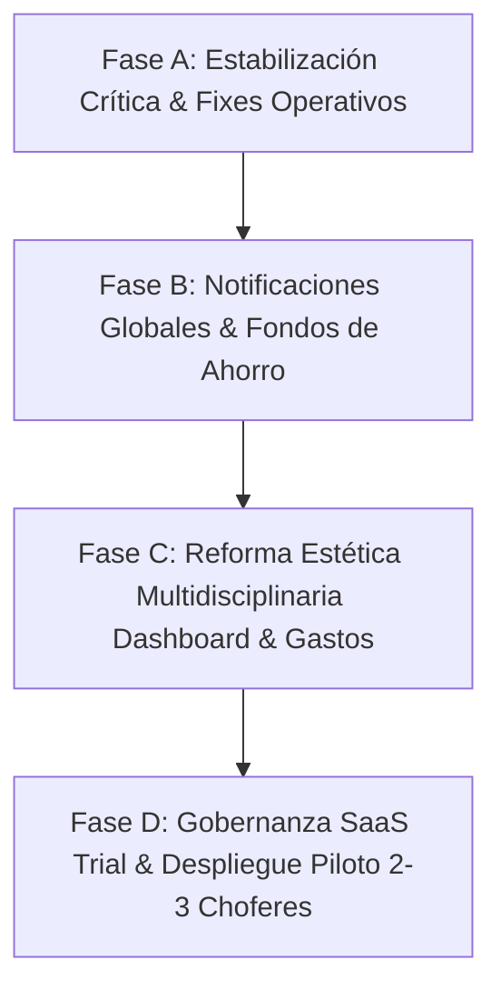

# 📋 Plan de Trabajo Integral: Mejoras Funcionales, Reforma Estética Multidisciplinaria y Testing Piloto

**Fecha:** 2026-09-27  
**Elaborado por:** Project Manager & Equipo de Especialistas (Backend, Frontend, UX/UI, Arquitectura, Seguridad, Base de Datos, Testing)  
**Proyecto:** AutoGastos SaaS (App Norte 2.0)  
**Estado:** Propuesta Técnica y Hoja de Ruta para Aprobación del Desarrollador (**Cero código modificado en esta fase**)

---

## 🧭 1. Resumen Ejecutivo y Nuevos Objetivos

A partir de la última sesión de pruebas exhaustivas del desarrollador y el backlog consolidado en `Docs/mejoras_pendientes.md`, este plan de trabajo define la estrategia técnica para estabilizar las funcionalidades críticas, modernizar la estética visual del sistema y preparar la aplicación para una **prueba piloto con 2 a 3 usuarios reales**.

### Ejes Estratégicos del Ciclo:
1. **Eje A (Estabilización Crítica de Flujos):** Resolver de raíz la persistencia y reflejo del gasto compartido en la sesión del invitado al aceptar la invitación, habilitar la edición de cuentas conjuntas (porcentajes y desligue), ocultar tarjetas de chofer en configuración si el módulo está inactivo, y solucionar el switch de usuario en Google OAuth (`select_account`).
2. **Eje B (Comunicación & Finanzas Flexibles):** Dotar a la aplicación de un Centro de Notificaciones visible en Navbar (campanita/badge) para evitar alertas ocultas en `/settings`, e introducir el módulo de Fondos de Ahorro / Reserva con declaración manual de aportes por parte del usuario.
3. **Eje C (Reforma Estética Integral sin Romper Lógica):** Rediseño visual profundo del Dashboard y de la Pantalla de Gastos a cargo del equipo multidisciplinario (UX/UI, Frontend, Arquitectura y Ciberseguridad), enfocado estrictamente en jerarquía visual, legibilidad y acabados premium, preservando al 100% los contratos de API y cálculos de negocio existentes.
4. **Eje D (SaaS Onboarding & Onboarding Piloto):** Período de prueba demo/trial para nuevos registros, diferenciación del usuario Administrador como sandbox de pruebas/auditoría (no chofer operativo), y puesta en marcha con 2 a 3 usuarios invitados.

---

## 🔍 2. Diagnóstico Técnico de los Requerimientos Reportados

### 2.1. Bug en Gastos Compartidos / Mancomunados (MJ-09)
* **Comportamiento reportado:** El Usuario A crea un gasto conjunto con el Usuario B. El Usuario B ve la invitación en su configuración y la acepta, pero al dirigirse a su pantalla de gastos, el ítem no aparece cargado ni se le imputa el porcentaje correspondiente en su balance mensual.
* **Diagnóstico técnico:**
  * En `/api/households` o `/api/expenses`, al cambiar el estado de `household_members` de `pending` a `accepted`, no se está disparando la sincronización en la consulta de gastos del miembro secundario o la relación en la base de datos consulta únicamente por `expenses.user_id = authUser.id` en lugar de incluir los gastos de hogares en los que participa con estado `accepted`.
  * Tampoco se está inicializando el registro en `expense_payments` para el usuario invitado, impidiéndole marcar su parte proporcional como cancelada.

### 2.2. Gestión de Cuenta Conjunta y Desligue de Gastos (MJ-15)
* **Comportamiento reportado:** Una vez creado el hogar, no se pueden modificar los porcentajes pactados ni desvincular un gasto que fue asignado erróneamente o que dejó de ser compartido.
* **Diagnóstico técnico:**
  * Falta endpoint PATCH/PUT en `/api/households/[id]` para actualizar los coeficientes porcentuales de los miembros (validando que la suma de porcentajes de miembros activos sea exactamente 100%).
  * Falta acción de "Desligar gasto" en `/api/expenses/[id]` que devuelva `household_id = null` y reasigne `split_ratio = 100%` al propietario original sin borrar el historial de pagos cancelados.

### 2.3. Inconsistencia de Feature Flags en `/settings` (MJ-16)
* **Comportamiento reportado:** A un suscriptor que solo tiene contratado el módulo de gastos (`moduleDriver: false`), la pantalla de Configuración le sigue mostrando las tarjetas "Modalidad de Vehículo" y "Plataformas & Apps de Trabajo".
* **Diagnóstico técnico:**
  * En `src/app/settings/page.jsx`, el renderizado de dichas tarjetas no tiene un guard condicional que verifique `user.moduleDriver`. Basta condicionar la sección a `if (user?.moduleDriver)` para que la interfaz sea 100% coherente con el plan del usuario.

### 2.4. Sesión Persistente en Google OAuth (MJ-20)
* **Comportamiento reportado:** Al hacer logout en AutoGastos, si otro usuario intenta iniciar sesión con Google en la misma máquina, el navegador omite el selector de cuentas y reingresa automáticamente con la cuenta de Google previa.
* **Diagnóstico técnico:**
  * La URL inicial de OAuth en `/api/auth/google` no incluye el parámetro `prompt=select_account`.
  * Al agregarlo, Google obliga al usuario a elegir con qué cuenta desea continuar, permitiendo alternar usuarios sin conflictos en una misma computadora.

### 2.5. Notificaciones Ocultas en Configuración (MJ-17)
* **Comportamiento reportado:** Las invitaciones a gastos compartidos solo se enteran si el usuario viaja manualmente a `/settings`.
* **Diagnóstico técnico:**
  * La aplicación carece de un canal global de comunicación en la interfaz. El Navbar debe consultar el conteo de acciones pendientes (invitaciones a hogares con estado `pending`) y renderizar una campanita con badge y menú desplegable de respuesta directa.

---

## 👥 3. Asignación de Roles del Equipo Especializado

| Agente / Rol | Área de Responsabilidad | Foco en este Plan |
|---|---|---|
| **01. Project Manager (PM)** | Coordinación general | Planificación, control de alcance, actualización de bitácora y comunicación fluida con el desarrollador. |
| **02. Backend / API** | Route Handlers & Lógica de Negocio | Corrección de querys de gastos compartidos, endpoints de notificaciones, fondos de ahorro y trial de usuarios. |
| **05. Frontend & UI** | React 19 / CSS Vanilla / Blade | Campanita de notificaciones en Navbar, modales de edición de hogar, ocultamiento condicional en settings y maquetación de modales. |
| **06. UX/UI Specialist** | Experiencia de usuario & Estética | Rediseño visual del Dashboard y Pantalla de Gastos, contraste WCAG en Modo Claro, diseño de la gráfica Mínimo vs Ideal. |
| **07. Seguridad** | Control de Acceso & Sesiones | Parámetro `prompt=select_account` en Google OAuth, invalidación estricta de cookies al logout, aislamiento de datos del Admin. |
| **08. Testing** | Pruebas Unitarias y de Integración | Validación de flujo bidireccional de gastos compartidos, simulación de usuarios invitados, prueba de switch de cuenta Google. |
| **09. Base de Datos (PostgreSQL)** | Esquema Drizzle y Migraciones | Tablas para fondos de ahorro (`saving_funds`, `fund_contributions`) y campo de expiración demo (`trial_ends_at`). |
| **12. Arquitectura & Patrones** | Calidad & No-Regresión | Salvaguardar que la reforma visual no modifique fórmulas, endpoints ni contratos de datos existentes. |

---

## 🛠️ 4. Plan de Acción Detallado por Fases

---

### 📌 FASE A: Estabilización Crítica & Fixes de Prueba Operativa
* **Objetivo:** Resolver los bloqueantes funcionales detectados durante las pruebas para que la interacción multiusuario y la configuración sean impecables.
* **Comando sugerido:** `@fix estabilizacion critica fase A`
* **Entregables específicos:**
  1. **Fix MJ-09 (Gastos Compartidos):**
     * Actualizar `/api/expenses/route.js` para que al consultar los gastos del usuario autenticado, incluya:
       `WHERE user_id = authId OR household_id IN (SELECT household_id FROM household_members WHERE user_id = authId AND status = 'accepted')`.
     * Calcular dinámicamente el importe que le corresponde según su porcentaje en dicho hogar.
     * Permitir al usuario invitado marcar su cuota en `expense_payments` de forma independiente al creador.
  2. **Fix MJ-15 (Edición de Hogar y Desligue):**
     * Modal para modificar nombre de cuenta conjunta y repartición de porcentajes (con validación total = 100%).
     * Botón "Desligar gasto" en `/expenses` para convertirlo en gasto 100% personal sin eliminar registros.
  3. **Fix MJ-16 (Condicional en `/settings`):**
     * Envolver las tarjetas "Modalidad de Vehículo" y "Plataformas & Apps de Trabajo" bajo `if (user?.moduleDriver)`.
  4. **Fix MJ-20 (Google OAuth Logout & Select Account):**
     * Incorporar `prompt: 'select_account'` y `access_type: 'offline'` en la generación de URL de Google Auth.
     * En `/api/auth/logout`, limpiar exhaustivamente cookies de sesión y redirigir a `/login?logged_out=1`.
  5. **Fix MJ-23 (Revisiones y Ajustes Intermedios en Mantenimiento / Caso Frenos):**
     * **Caso de uso:** Intervalo mayor de frenos cada 30.000 km o 1 año; necesidad de asentar revisiones intermedias (regulación de cintas, chequeo de pastillas, purga) con costo, taller y fecha sin reiniciar obligatoriamente el contador de cambio mayor.
     * **Solución técnica:** Incorporar selector de tipo de acción en `ServiceDoneModal.jsx` (`'service_completo'` vs `'revision_ajuste'`) con toggle "¿Reiniciar contador de kilometraje y tiempo?". Registrar `action_type` en `maintenance_history` y reflejar ambas fechas/km en la tarjeta de `/vehicle`.

---

### 📌 FASE B: Notificaciones Globales, Aporte a Fondos & Rol Admin
* **Objetivo:** Garantizar que los usuarios se enteren de acciones pendientes en tiempo real y permitir crear reservas financieras manuales.
* **Comando sugerido:** `@dev notificaciones y fondos fase B`
* **Entregables específicos:**
  1. **Feature MJ-17 (Centro de Notificaciones en Navbar):**
     * Componente `NotificationCenter.jsx` integrado en `Navbar.jsx`.
     * Icono de campanita con contador visual de invitaciones pendientes.
     * Menú desplegable con acciones rápidas: botón "Aceptar" y "Rechazar" que actualizan el estado en un clic.
  2. **Feature MJ-19 (Módulo de Fondos de Ahorro con Aporte Manual):**
     * Tablas en base de datos: `saving_funds` (id, user_id, name, target_amount, current_balance, icon, color) y `fund_contributions` (id, fund_id, amount, date, payment_method, note).
     * Modal interactivo "+ Aportar al Fondo" donde el usuario ingresa manualmente el monto en pesos que desea destinar a su reserva.
     * Visualización destacada en la sección de Gastos como ahorro real acumulado.
  3. **Refinamiento MJ-22 (Rol Administrador como Sandbox de Pruebas):**
     * Exclusión de los registros de prueba generados por cuentas `role: 'admin'` de las métricas agregadas globales de la plataforma.

---

### 📌 FASE C: Reforma Estética Multidisciplinaria (Dashboard, Gastos y Modo Claro)
* **Objetivo:** Transformar la presentación visual para elevar la percepción de valor y claridad del usuario, respetando al 100% la lógica operativa existente.
* **Comando sugerido:** `@dev reforma estetica multidisciplinaria fase C`
* **Participación:** Especialista UX/UI + Frontend Blade + Arquitecto + Ciberseguridad.
* **Entregables específicos:**
  1. **Reforma MJ-02 (Dashboard):**
     * Reorganización visual y jerárquica de bloques: Disponibilidad de caja / Arqueo diario, Termómetro de metas, resumen de obligaciones del mes, odómetro y semáforos mecánicos más urgentes.
     * Acabado premium con microinteracciones sutiles y tarjetas bien estructuradas.
  2. **Reforma MJ-18 (Pantalla de Gastos):**
     * Rediseño de tarjetas de métricas: Total Obligaciones, Pagado, Pendiente, Adelantos Aplicados.
     * Organización visual diferenciada para gastos fijos mensuales, compras en cuotas con barras de progreso de cuotas (ej. `3/12`), y gastos compartidos del hogar.
  3. **Ajuste MJ-01 (Modo Claro / Light Theme):**
     * Revisión integral de contraste WCAG AA en `globals.css` para textos, tablas, inputs y badges sobre fondo claro.
  4. **Visualización MJ-14 (Gráfica Diaria de Mínimo e Ideal):**
     * Integración de la gráfica de rendimiento diario según el boceto/gráfico de referencia que suministre el desarrollador, mostrando la evolución del mes frente a la línea de mínimo y la meta ideal.

---

### 📌 FASE D: Gobernanza SaaS (Trial/Demo) y Despliegue de Piloto
* **Objetivo:** Habilitar el modelo de negocio con períodos de prueba y coordinar el testing con usuarios reales.
* **Comando sugerido:** `@dev gobernanza trial y testing piloto fase D`
* **Entregables específicos:**
  1. **Feature MJ-21 (Período de Prueba Demo):**
     * Asignación automática de `subscriptionStatus = 'trial'` con vigencia de 14 días al registrarse.
     * Banner informativo sutil de días restantes en el Dashboard.
     * En el panel `/admin`, capacidad de extender el trial o promover a cuenta `active`.
  2. **Puesta a Punto de Producción & Guía para Piloto:**
     * Verificación de build y conexión Cloudflare + Supabase.
     * Convocatoria y onboarding de **2 a 3 usuarios reales** para probar jornadas, gastos compartidos, fondos y arqueos diarios en condiciones reales de trabajo en la calle.

---

## 🗺️ 5. Hoja de Ruta de Implementación & Estado de Avance

| Fase | Título / Alcance | Estado | Detalle y Entregables |
|---|---|---|---|
| **Fase Histórica (1 a 4)** | **Fundamentos, Telegram, Gobernanza y Conciliación** | ✅ **COMPLETADA** | Setup Cloudflare/Supabase, parser de Telegram multilínea, odómetro bidireccional, flags de módulos, adelantos de apps y arqueo de caja con acumulado semanal. |
| **Fase A** | **Estabilización Crítica & Fixes de Flujo** | ⏳ **PENDIENTE** | Fix MJ-09 (gastos compartidos en sesión del invitado), Fix MJ-15 (edición de hogar y desligue), Fix MJ-16 (ocultar tarjetas inactivas en settings), Fix MJ-20 (logout y select_account en Google OAuth), Fix MJ-23 (registro de revisiones/ajustes en frenos sin reset obligatorio de odómetro). |
| **Fase B** | **Notificaciones Globales & Fondos de Ahorro** | ⏳ **PENDIENTE** | Feature MJ-17 (campanita/badge de notificaciones en Navbar), Feature MJ-19 (módulo de fondos con aportes manuales en gastos), Refinamiento MJ-22 (admin como sandbox de pruebas). |
| **Fase C** | **Reforma Estética Integral Multidisciplinaria** | ⏳ **PENDIENTE** | Rediseño MJ-02 (Dashboard premium), Rediseño MJ-18 (Gastos organizado), Fix MJ-01 (contraste modo claro WCAG), Gráfica MJ-14 (mínimo vs ideal diario según boceto). |
| **Fase D** | **Gobernanza SaaS Trial & Testing Piloto (2-3 Usuarios)** | ⏳ **PENDIENTE** | Feature MJ-21 (cuentas demo/trial con plazo temporal), control en panel admin, verificación en producción y sesión de pruebas con 2 a 3 usuarios reales. |
| **Hito Arquitectónico** | **Blueprint de Migración a Laravel 13 + Tailwind + MySQL** | 📋 **DOCUMENTADO** | Plan MJ-24: Arquitectura Laravel 12/13 modular, esquema relacional MySQL, stack frontend Blade + Tailwind CSS, integración de bots en Queue y opciones de hosting gratuito (Oracle Cloud / Render / TiDB). |

---

## 📝 6. Bitácora de Hitos Cumplidos

Esta bitácora es el **registro cronológico de hitos alcanzados**. Se mantendrá permanentemente actualizada a medida que el equipo ejecute cada fase aprobada:

### 🏛️ Hitos Consolidados del Ciclo Previo:
* **2026-09-24 (Fase 1 - Infraestructura):** Plan inicial aprobado. Configuración de conexión Cloudflare Workers (OpenNext) con Supabase Transaction Pooler (puerto 6543, SSL) documentada y verificada.
* **2026-09-24 (Fase 2 - Telegram & Validaciones):**
  * Parser multilínea de `/jornada` inmune a cruces de renglones (`horas: 6` y `otros: 2000`).
  * Captura de notas/observaciones (`notas:`, `obs:`) en Telegram y web.
  * Nuevo comando interactivo `/gasto` con cuotas y medios de pago.
  * Servicio `syncUserOdometer()` para recalibración y retroceso automático del odómetro general al editar/eliminar jornadas.
  * Unificación de validaciones Zod para minutos acumulados sin error de tope 59.
* **2026-09-24 (Fase 3 - Gobernanza SaaS & Módulos):**
  * Edge Middleware y React Guards para blindar `/driver`, `/expenses` y `/vehicle` según el plan del suscriptor.
  * Navegación condicional en `Navbar.jsx` y banner amigable en `/dashboard`.
  * Exclusividad del Administrador para alterar módulos; API `/api/user/profile` protegida contra modificaciones no autorizadas.
* **2026-09-24 (Fase 4 - Adelantos & Conciliación de Caja):**
  * Modelo de `app_advances` para retiros de Uber/Cabify sin distorsionar facturación bruta devengada ni rendimiento $/h.
  * Comando `/adelanto` en Telegram Bot.
  * Módulo interactivo de Arqueo y Conciliación de Caja (`CashReconciliationModal.jsx`) con soporte de acumulado en apps (`real_apps`) y blanqueo por gastos no anotados o ajuste directo de ritmo diario.
  * Imputación de adelantos directo a gastos del mes (`expense_id`) con badges informativos en la tabla de `/expenses`.
* **2026-09-24 (Sesión Operativa de Testing):**
  * Corregido orden de React Hooks en `GoalThermometer.jsx`.
  * Filtro estricto para mostrar únicamente las apps activas del usuario (`user.activeApps`) en liquidaciones.
  * Integración de `appBreakdownTotals` en la respuesta JSON de `/api/summary`.
  * Parser de Telegram enriquecido para soportar tildes (`odómetro`) y separadores de miles (`190.850 km`).

---

### 🚀 Hitos del Ciclo Actual (En Planificación para Ejecución):
*(Aquí se asentarán los hitos de las Fases A, B, C y D a medida que el desarrollador dé luz verde a su ejecución)*

* **2026-09-27:** Plan de trabajo formalizado y presentado para aprobación del desarrollador. Priorización establecida en 4 fases secuenciales. **Cero código alterado en esta sesión de planificación.**
* *(Próximo hito pendiente de inicio: Fase A — Estabilización Crítica & Fixes Operativos)*

---

## 📌 Guía para Anexar Nuevos Fixes o Requerimientos Durante las Pruebas

Como el desarrollador continuará realizando pruebas continuas en la plataforma:
1. Cualquier nuevo bug o ajuste que surja durante las pruebas se incorporará de inmediato en la **Fase A (Estabilización Crítica)** o en la sección correspondiente según su impacto.
2. Para dar inicio a la implementación de cualquiera de las fases o ítems específicos, simplemente invoca al equipo con el comando sugerido (ej. `@fix estabilizacion critica fase A` o el ítem puntual).
