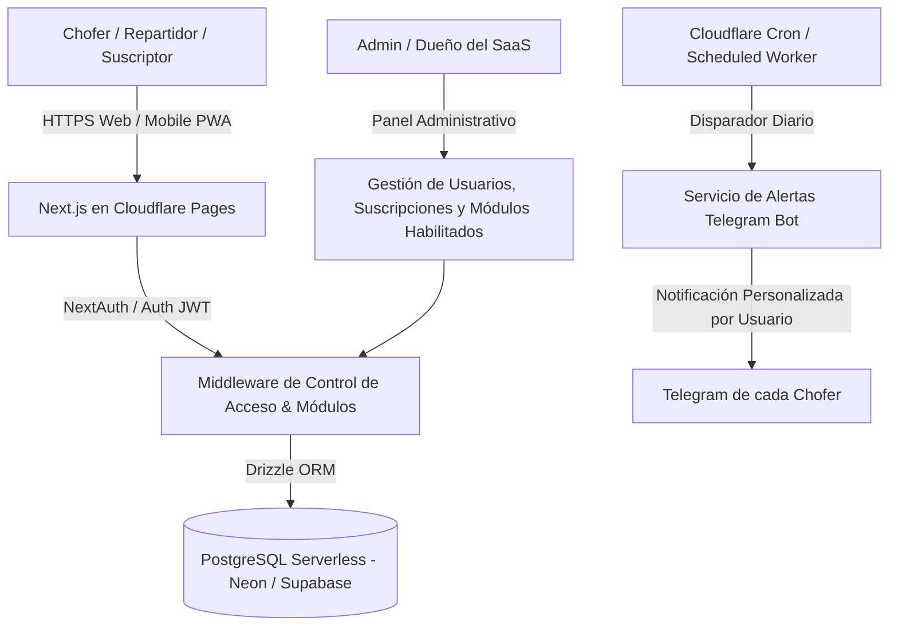
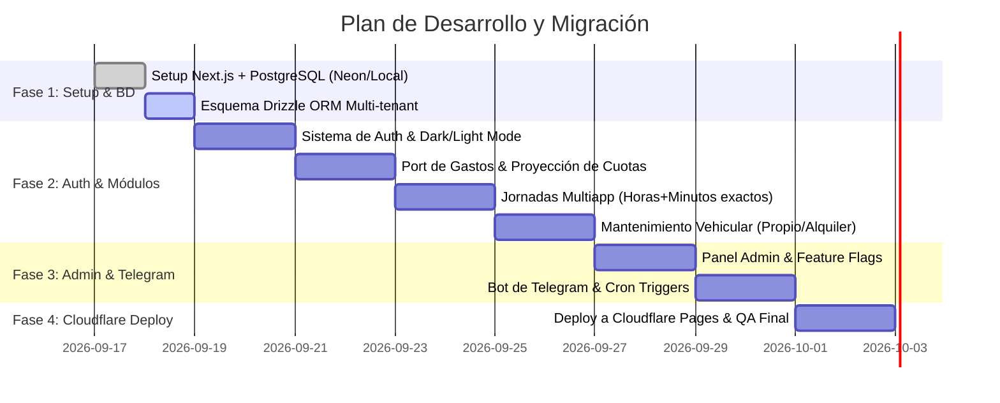

# 🚀 Plan Maestro: Migración, Arquitectura SaaS y Nuevas Features (Next.js + PostgreSQL + Cloudflare)

**Fecha:** 2026-09-17  
**Rol:** Project Manager & Arquitecto de Software  
**Destino:** Cloudflare Pages/Workers + PostgreSQL Serverless (Neon / Supabase) + Next.js (React)  
**Estado:** Propuesta Técnica y Plan de Ejecución Actualizado

---

## 🧭 1. Diagnóstico y Visión de Negocio (Mercado Argentina & LatAm)

### 💡 Nicho y Potencial Comercial
La propuesta de valor es gigantesca al expandirla de "solo Uber" a un **Ecosistema Integral de Movilidad y Delivery Multiapp**:
1. **Multiapp (Uber, Cabify, DiDi, InDrive, Rappi, PedidosYa, Mensajería):**  
   Los choferes y repartidores rara vez trabajan con una sola app; combinan varias durante el día para maximizar su tiempo. La app debe permitir registrar ingresos consolidados o desglosados por plataforma.
2. **Los Dos Grandes Perfiles de Choferes en Argentina:**
   * **Perfil A — Dueño del Auto:** Se hace cargo del 100% del mantenimiento mecánico (aceite, cubiertas, frenos, correa), trámites anuales (VTV, Oblea GNC, Patente) y seguro. Requiere el fondo de provisión y semáforo de kilometraje.
   * **Perfil B — Chofer con Auto Alquilado (Alquiler semanal/mensual):** Paga un canon de alquiler fijo al dueño (ej. semanal o mensual). El dueño se encarga de la mecánica e impuestos; el chofer solo necesita registrar el pago de su alquiler, combustible y controlar su ganancia limpia real.

---

## 🏗️ 2. Arquitectura Tecnológica Propuesta



* **Frontend & Backend:** **Next.js (App Router)** con Server Actions y API Routes.
* **Base de Datos:** **PostgreSQL Serverless (Neon.tech / Supabase)** con **Drizzle ORM** (cero problemas de drivers en Cloudflare, compatible en local y nube).
* **Validaciones:** **Zod** + React Hook Form (mensajes claros e intuitivos campo por campo).
* **Autenticación Multi-Tenant:** Cada usuario tiene sus datos 100% aislados.
* **Estilos:** Dark Mode y Light Mode con persistencia por usuario.
* **Automatización:** Telegram Bot API individualizado con Cron Triggers.

---

## 📦 3. Modelo de Datos Multi-Usuario (PostgreSQL)

```mermaid
erDiagram
    USERS {
        UUID id PK
        VARCHAR email UK
        VARCHAR password_hash
        VARCHAR name
        VARCHAR role "'admin' | 'user'"
        VARCHAR driver_type "'owner' | 'renter'" "Dueño de auto vs Alquiler"
        VARCHAR active_apps "JSON array: ['uber', 'cabify', 'didi', 'rappi']"
        BOOLEAN module_driver "Habilita Jornadas Apps"
        BOOLEAN module_expenses "Habilita Gastos y Cuotas"
        BOOLEAN module_vehicle "Habilita Mantenimiento Auto"
        VARCHAR theme_preference "'dark' | 'light' | 'system'"
        VARCHAR telegram_chat_id "Chat ID personal de Telegram"
        INTEGER telegram_alert_days "Días antes de fin de mes (ej. 5)"
        BOOLEAN telegram_enabled "Activar/Desactivar bot"
        VARCHAR subscription_status "'trial' | 'active' | 'suspended'"
        TIMESTAMP created_at
    }

    DAILY_LOGS {
        UUID id PK
        UUID user_id FK
        DATE date UK_per_user
        DECIMAL gross_income "Facturación total de la jornada"
        VARCHAR app_breakdown "JSON: { uber: 35000, cabify: 22000, didi: 0, rappi: 0 }"
        DECIMAL fuel_expense "Combustible (GNC/Nafta)"
        DECIMAL other_expense "Peajes, lavadero, refrigerio"
        INTEGER odometer_km "Odómetro al finalizar el día"
        INTEGER minutes_worked "Ej: 347 minutos = 5h 47m"
        INTEGER trips_count "Total de viajes realizados"
        TEXT notes "Comentarios del día"
    }

    VEHICLE_MAINTENANCE {
        UUID id PK
        UUID user_id FK
        VARCHAR name
        VARCHAR tracking_type "'km' | 'time' | 'hybrid'"
        INTEGER interval_km
        INTEGER interval_months
        INTEGER fixed_due_month
        INTEGER fixed_due_day
        INTEGER last_service_km
        DATE last_service_date
        DATE next_due_date
        DECIMAL estimated_cost
        VARCHAR category
        VARCHAR priority
        BOOLEAN is_document
        TEXT notes
    }

    EXPENSES {
        UUID id PK
        UUID user_id FK
        VARCHAR name
        VARCHAR category
        VARCHAR type "'fixed' | 'one_time' | 'installment'"
        DECIMAL total_amount
        INTEGER installment_count
        DECIMAL installment_amount
        VARCHAR start_month "YYYY-MM"
        VARCHAR end_month "YYYY-MM"
        BOOLEAN is_shared
        DECIMAL user_share_pct
        VARCHAR payment_method
        VARCHAR status
        TEXT notes
    }

    USERS ||--o{ DAILY_LOGS : "posee"
    USERS ||--o{ VEHICLE_MAINTENANCE : "posee"
    USERS ||--o{ EXPENSES : "posee"
```

---

## ✨ 4. Detalle de Mejoras y Nuevas Funcionalidades

### 4.1. 🚗 Movilidad & Delivery Multiapp (Uber, Cabify, DiDi, Rappi, etc.)
* **Selector y Configuración de Apps:**
  - El usuario puede elegir con qué apps trabaja (ej. Uber + Cabify + DiDi).
  - Al cargar la jornada, puede ingresar el total directo o desglosar cuánto facturó en cada plataforma.
* **Horas y Minutos Exactos:**
  - `[ Horas ]` y `[ Minutos ]` (ej: 5h 47m).
  - Guarda `minutes_worked` y calcula rendimiento real por hora trabajada (`$/hora`).

### 4.2. 🚘 Modalidad de Trabajo: Auto Propio vs Auto Alquilado
* **Configuración del Perfil:**
  - **Auto Propio:** Acceso completo al semáforo de kilometraje, VTV, Oblea GNC, prueba hidráulica, fondo de repuestos y regularización de patente.
  - **Auto Alquilado (Chofer a Alquiler):** Se desactiva la provisión de repuestos del dueño y se configura el canon de alquiler (semanal o mensual) como gasto operativo principal en las metas.

### 4.3. 🤖 Bot de Telegram 100% Personalizado por Usuario
* Cada chofer conecta su cuenta de Telegram a través de un comando único (ej: `/start TOKEN_USUARIO`).
* **Mensaje Programado:** El usuario configura cuántos días antes del cierre del mes quiere recibir el reporte (ej: 5 días antes, 3 días antes o diario).
* **Reporte Automático Personalizado:**
  ```text
  🚗 ¡Hola Juan! Tu resumen financiero al día (Faltan 5 días para fin de mes):

  📱 Jornadas del Mes (Uber + Cabify + DiDi):
  • Facturado Bruto: $680.000 (18 días trabajados • 112h 30m)
  • Combustible: -$135.000
  • Ganancia Neta Limpia: $545.000 ($4.844 / hora)

  💳 Tus Obligaciones del Mes:
  • Gastos Fijos (tu parte): $380.000
  • Cuotas de Tarjetas (4 activas): $88.500
  • Total a Cubrir: $468.500
  -----------------------------------
  🎉 BALANCE LIBRE: +$76.500 (¡Meta Mínima Superada!)

  🔧 Alertas del Vehículo:
  🔴 VTV: Vence en 3 días ($44.000)
  🟡 Cambio de Aceite: Te quedan 450 km
  ```

### 4.4. 🛡️ Validaciones Claras e Informativas (Zod)
* Indicación visual precisa en el campo erróneo:
  - *"El odómetro final (144.200 km) no puede ser inferior al último registrado (144.820 km)"*.
  - *"Debes ingresar un valor mayor a $0 en facturación"*.
  - *"Ya existe una jornada para esta fecha. Podés editarla desde la tabla"*.

### 4.5. 🔐 Autenticación Multi-Tenant (SaaS)
* Cuentas de usuario independientes con login seguro.
* Modo Claro / Oscuro persistente por cuenta.

### 4.6. 👑 Panel de Administración & Feature Flags
* Vista exclusiva para el Administrador:
  - Lista de suscriptores y estados de cuenta (Prueba / Activo / Vencido).
  - Toggles por usuario para habilitar/deshabilitar módulos:
    - 🔘 Módulo Multiapp (Jornadas, combustible, odómetro).
    - 🔘 Módulo Gastos & Cuotas (Gastos fijos, cuotas, proyecciones a 12 meses).
    - 🔘 Módulo Mantenimiento Vehicular (Services, documentación, fondo de repuestos).

---

## 🗺️ 5. Plan de Ejecución Paso a Paso



---

## 📌 6. Conclusión y Aprobación

El plan cubre toda la lógica de negocio actual, la adapta al modelo multi-app para choferes y repartidores, contempla la realidad de autos propios vs alquilados en Argentina/LatAm, y establece las bases para un SaaS escalable y desplegable en Cloudflare con PostgreSQL gratuito.

> [!TIP]
> ¿Aprobás este plan para que comencemos con la **Fase 1: Inicialización del proyecto Next.js + Esquema PostgreSQL**?
