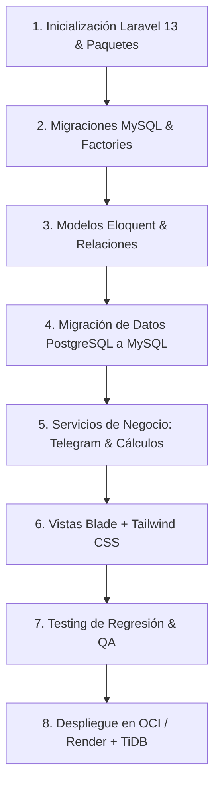

# 🚀 Plan Maestro de Migración: AutoGastos a Laravel 13 + Tailwind CSS + MySQL

**Fecha:** 2026-09-28  
**Autor:** Project Manager & Equipo de Arquitectura, Backend, Frontend, Base de Datos y Seguridad  
**Proyecto:** AutoGastos SaaS (App Norte)  
**Objetivo:** Guía técnica exhaustiva y hoja de ruta paso a paso para migrar la aplicación completa desde el stack actual (Next.js 16 + Drizzle + PostgreSQL + Cloudflare) hacia el stack corporativo robusto **Laravel 12/13 + Blade + Tailwind CSS + MySQL**, incluyendo alternativas de despliegue en la nube en capas **100% gratuitas (Zero Cost Tier)**.

---

## 🧭 1. Resumen Ejecutivo y Motivación

La aplicación actual está construida sobre:
- **Frontend / Fullstack:** Next.js 16 (React 19, Server & Client Components, App Router).
- **ORM & BD:** Drizzle ORM + PostgreSQL 17 (Supabase en producción, PostgreSQL local).
- **Hosting actual:** Cloudflare Workers (OpenNext Edge Serverless).

### ¿Por qué migrar a Laravel + Tailwind + MySQL?
1. **Productividad y Ecosistema Unificado:** Laravel ofrece de forma nativa autenticación robusta, validaciones (`FormRequests`), colas de trabajo (`Queues`), tareas programadas (`Scheduler`), migraciones estructuradas (`Artisan`), ORM expresivo (`Eloquent`) y notificaciones multicanal sin depender de paquetes dispersos de Node.js.
2. **Eliminación de la fricción Serverless:** En Next.js + Cloudflare Workers, mantener conexiones a bases de datos relacionales requiere proxies o poolers especiales (Hyperdrive, Supavisor en puerto 6543) y el soporte para tareas en segundo plano (Webhooks de Telegram, cálculo de resúmenes) es limitado por los timeouts de ejecución edge. Laravel gestiona procesos demonio, Workers y Scheduler de forma nativa.
3. **Mantenibilidad a largo plazo:** El patrón MVC / Service Layer en Laravel es estándar en la industria, reduce la complejidad de estado en React y simplifica drásticamente el desarrollo de módulos complejos como Arqueo de Caja, Mantenimiento y Facturación.

---

## 🏗️ 2. Mapeo Arquitectónico (Next.js ➔ Laravel 13)

| Componente Actual (Next.js 16) | Equivalente en Laravel 13 | Responsabilidad |
|---|---|---|
| `src/app/api/auth/*` (Jose JWT + Bcrypt) | `Laravel Breeze` / Session Auth / Sanctum | Autenticación con cookies HTTP-only encriptadas, protección CSRF y soporte API Tokens. |
| `src/app/api/auth/google/*` | `Laravel Socialite` (`GoogleProvider`) | Inicio de sesión con Google OAuth, respetando `prompt=select_account`. |
| `src/app/api/telegram/webhook/route.js` | `TelegramWebhookController` + `ProcessTelegramMessageJob` | Procesamiento asíncrono en cola sin riesgo de timeout ni pérdidas de mensajes. |
| `src/db/schema.js` (Drizzle pgTable) | `database/migrations/*` + `app/Models/*` | Modelos Eloquent con relaciones (`hasMany`, `belongsTo`, `belongsToMany`), scopes y accessors. |
| `src/lib/validations.js` (Zod) | `app/Http/Requests/*FormRequest` | Validación granular campo por campo con mensajes en español y feedback inline. |
| `src/lib/odometer.js`, `summary.js` | `app/Services/OdometerService.php`, `SummaryService.php` | Capa de servicios pura para lógica de cálculo financiero y odómetro. |
| React Components (`DailyLogModal.jsx`, etc.) | Blade Components + Tailwind CSS + Alpine.js | UI ultraligera, reactiva, accesible y de renderizado instantáneo. |
| `src/middleware.js` (Role & Module guard) | `app/Http/Middleware/CheckModuleAccess.php` | Protección estricta de rutas `/driver`, `/expenses`, `/vehicle` y `/admin`. |

---

## 🗄️ 3. Modelo de Datos y Migraciones MySQL

MySQL 8.0+ soporta tipos nativos `JSON`, índices funcionales y generación de UUIDs nativos (`uuid()`).

### Estructura de Tablas Migradas:

```
┌──────────────────┐       ┌──────────────────────┐       ┌─────────────────────┐
│      users       │◄──────│      households      │◄──────│  household_members  │
└─────────┬────────┘       └──────────┬───────────┘       └─────────────────────┘
          │                           │
          ├───────────────────────────┼────────────────────────┐
          │                           │                        │
          ▼                           ▼                        ▼
┌──────────────────┐       ┌──────────────────────┐       ┌─────────────────────┐
│    daily_logs    │       │       expenses       │◄──────│   app_advances      │
└──────────────────┘       └──────────┬───────────┘       └─────────────────────┘
                                      │
                                      ▼
                           ┌──────────────────────┐
                           │   expense_payments   │
                           └──────────────────────┘

┌────────────────────────┐ ┌──────────────────────┐ ┌───────────────────────────┐
│  vehicle_maintenance   │ │ maintenance_history  │ │   cash_reconciliations    │
└────────────────────────┘ └──────────────────────┘ └───────────────────────────┘
```

### 1. Migración de Usuarios (`users`)
```php
Schema::create('users', function (Blueprint $table) {
    $table->uuid('id')->primary();
    $table->string('name');
    $table->string('email')->unique();
    $table->string('password');
    $table->string('role', 50)->default('user'); // 'admin' | 'user'
    $table->string('google_id')->nullable();
    $table->string('avatar_url', 500)->nullable();
    $table->string('driver_type', 50)->default('owner'); // 'owner' | 'renter'
    $table->json('active_apps')->nullable(); // ['uber', 'cabify', 'didi']
    
    // Feature flags
    $table->boolean('module_driver')->default(true);
    $table->boolean('module_expenses')->default(true);
    $table->boolean('module_vehicle')->default(true);
    
    // Configuración general y Telegram
    $table->string('theme_preference', 20)->default('dark');
    $table->string('telegram_chat_id', 100)->nullable();
    $table->integer('telegram_alert_days')->default(5);
    $table->boolean('telegram_enabled')->default(false);
    $table->string('subscription_status', 50)->default('trial');
    $table->timestamp('trial_ends_at')->nullable();
    
    $table->rememberToken();
    $table->timestamps();
});
```

### 2. Migración de Mantenimiento Vehicular e Historial (Con Soporte para Revisiones MJ-23)
```php
Schema::create('vehicle_maintenance', function (Blueprint $table) {
    $table->uuid('id')->primary();
    $table->foreignUuid('user_id')->constrained()->cascadeOnDelete();
    $table->string('name');
    $table->string('tracking_type', 50)->default('hybrid'); // 'km' | 'time' | 'hybrid'
    $table->integer('interval_km')->default(10000);
    $table->integer('interval_months')->default(12);
    $table->integer('fixed_due_month')->nullable();
    $table->integer('fixed_due_day')->default(30);
    $table->integer('last_service_km')->default(0);
    $table->date('last_service_date')->nullable();
    $table->date('next_due_date')->nullable();
    $table->decimal('estimated_cost', 12, 2)->default(0);
    $table->string('category', 100)->default('Motor / Service');
    $table->string('priority', 50)->default('normal');
    $table->boolean('is_document')->default(false);
    $table->text('notes')->nullable();
    $table->timestamps();
});

Schema::create('maintenance_history', function (Blueprint $table) {
    $table->uuid('id')->primary();
    $table->foreignUuid('user_id')->constrained()->cascadeOnDelete();
    $table->foreignUuid('maintenance_id')->nullable()->constrained('vehicle_maintenance')->nullOnDelete();
    $table->string('maintenance_name');
    $table->date('service_date');
    $table->integer('service_km')->default(0);
    $table->decimal('cost_paid', 12, 2)->default(0);
    $table->string('action_type', 50)->default('service_completo'); // 'service_completo' | 'revision_ajuste' (MJ-23)
    $table->boolean('reset_counter')->default(true); // Indica si reseteó el ciclo mayor
    $table->text('workshop_notes')->nullable();
    $table->timestamps();
});
```

### 3. Migración de Jornadas (`daily_logs`)
```php
Schema::create('daily_logs', function (Blueprint $table) {
    $table->uuid('id')->primary();
    $table->foreignUuid('user_id')->constrained()->cascadeOnDelete();
    $table->date('date');
    $table->decimal('gross_income', 12, 2)->default(0);
    $table->json('app_breakdown')->nullable();
    $table->decimal('fuel_expense', 12, 2)->default(0);
    $table->decimal('other_expense', 12, 2)->default(0);
    $table->integer('odometer_km')->default(0);
    $table->integer('minutes_worked')->default(0);
    $table->integer('trips_count')->default(0);
    $table->text('notes')->nullable();
    $table->timestamps();

    $table->unique(['user_id', 'date']);
});
```

### 4. Migración de Conciliaciones de Caja y Adelantos
```php
Schema::create('app_advances', function (Blueprint $table) {
    $table->uuid('id')->primary();
    $table->foreignUuid('user_id')->constrained()->cascadeOnDelete();
    $table->string('app', 50)->default('uber');
    $table->decimal('amount', 12, 2)->default(0);
    $table->date('date');
    $table->string('month', 7);
    $table->string('destination', 50)->default('Mercado Pago');
    $table->foreignUuid('expense_id')->nullable()->constrained('expenses')->nullOnDelete();
    $table->text('notes')->nullable();
    $table->timestamps();
});

Schema::create('cash_reconciliations', function (Blueprint $table) {
    $table->uuid('id')->primary();
    $table->foreignUuid('user_id')->constrained()->cascadeOnDelete();
    $table->date('date');
    $table->string('month', 7);
    $table->decimal('theoretical_balance', 12, 2)->default(0);
    $table->decimal('real_cash', 12, 2)->default(0);
    $table->decimal('real_bank', 12, 2)->default(0);
    $table->decimal('real_apps', 12, 2)->default(0);
    $table->decimal('total_real', 12, 2)->default(0);
    $table->decimal('difference', 12, 2)->default(0);
    $table->string('adjustment_type', 50)->default('none');
    $table->decimal('adjustment_amount', 12, 2)->default(0);
    $table->text('notes')->nullable();
    $table->timestamps();
});
```

---

## 🎨 4. Frontend: Blade + Tailwind CSS v4 + Alpine.js

En lugar de lidiar con `hydration errors`, bundles pesados de React y dependencias complejas, la arquitectura propuesta utiliza:
1. **Tailwind CSS v4:** Instalado mediante `@tailwindcss/vite`, con paleta moderna dark/light idéntica a AutoGastos.
2. **Blade Components:** Componentes modulares reutilizables para modales, KPI cards, badges, barras de progreso y tablas.
3. **Alpine.js:** Manejo de estado liviano para aperturas/cierres de modales, cálculos reactivos en tiempo real (ej. desglose de horas a minutos, comparador de arqueo de caja) y menús desplegables sin necesidad de empaquetadores complejos.

---

## ☁️ 5. Recomendaciones de Plataformas de Hosting 100% Gratuitas (Zero Cost Tier)

Cloudflare Workers es excelente para APIs serverless y estáticos, pero PHP/Laravel requiere un entorno de ejecución continuo (PHP-FPM / Nginx / Workers). A continuación se presentan las **mejores alternativas gratuitas de producción**:

### 🏆 Recomendación 1: Oracle Cloud Infrastructure (OCI) Always Free Tier (La Mejor y Más Potente)
* **¿Qué incluye gratis para siempre?:**
  - **4 OCPU de procesadores ARM Ampere A1** + **24 GB de memoria RAM** (se puede repartir en 1 o hasta 2 máquinas virtuales).
  - **200 GB de almacenamiento en disco SSD**.
  - **IP Pública fija** IPv4 e IPv6 incluida sin costo.
  - Tráfico de red saliente de hasta 10 TB/mes gratis.
* **¿Cómo se monta?:**
  - Se levanta una VM con Ubuntu 24.04 LTS.
  - Se instala **Coolify** (un clon de Vercel/Heroku de código abierto y autoalojado) con un solo comando:
    ```bash
    curl -fsSL https://cdn.coollabs.io/coolify/install.sh | bash
    ```
  - Coolify administra de forma visual:
    - Tu repositorio GitHub de Laravel.
    - Base de datos MySQL 8.0 nativa en contenedor con respaldos automáticos.
    - Supervisor para colas de Laravel (`php artisan queue:work`) para Telegram.
    - Certificados SSL automáticos con Let's Encrypt.
* **Veredicto:** Es infinitamente superior a cualquier hosting compartido, **no se apaga nunca**, no tiene límites de suspensión por inactividad y soporta cientos de choferes concurrentes sin costo.

---

### 🥈 Recomendación 2: Render.com (Web Service Gratis) + TiDB Cloud (MySQL Serverless Gratis)
Si prefieres una solución **100% gestionada (sin configurar Linux/VPS)**:

1. **Base de Datos MySQL: TiDB Cloud Serverless**
   - **Costo:** $0 / mes para siempre.
   - **Características:**
     - 100% compatible con el protocolo MySQL 8.0 (funciona directo con `DB_CONNECTION=mysql` en Laravel).
     - **5 GB de almacenamiento gratuito** con escalado automático.
     - Alta disponibilidad multi-zona y cifrado en reposo.
     - **No se duerme por inactividad** (a diferencia de Supabase free tier que pausa el proyecto a los 7 días sin uso).
2. **App Laravel: Render.com (Free Web Service)**
   - Despliegue automático conectado a tu rama `main` de GitHub mediante Dockerfile optimizado con PHP 8.3/8.4 + Nginx.
   - Incluye dominio SSL gratis (`https://tu-app.onrender.com`).
   - *Nota:* En la capa gratuita de Render, la instancia entra en reposo tras 15 minutos sin peticiones y tarda unos 30 segundos en despertar en la primera solicitud (esto se mitiga configurando un ping de UptimeRobot cada 10 minutos).

---

### 🥉 Recomendación 3: Koyeb / Railway / Zeabur
- **Koyeb:** Proporciona 2 microinstancias gratuitas continuas con despliegue de contenedores Docker o builds nativos desde GitHub. Conectado a TiDB Cloud Serverless o Aiven Free MySQL, permite tener Laravel en producción a costo $0.
- **Railway:** Otorga $5 USD mensuales de crédito de prueba gratuito en cuentas verified, ideal para staging rápido.

---

## 📋 6. Hoja de Ruta de Migración Paso a Paso



1. **Fase 1 (Scaffolding):**
   - `composer create-project laravel/laravel app-norte-laravel`.
   - Instalación de Tailwind CSS v4 y Alpine.js.
   - Configuración de `laravel/breeze` (Blade stack) y `laravel/socialite` (Google OAuth).
2. **Fase 2 (Base de Datos):**
   - Creación de migraciones estructuradas con UUIDs y claves foráneas.
   - Script Artisan `php artisan db:import-legacy` para trasladar los datos existentes de PostgreSQL/Supabase a MySQL.
3. **Fase 3 (Lógica de Negocio):**
   - Migrar `TelegramWebhookController` conectándolo a `ProcessTelegramMessageJob` para ejecución en background.
   - Migrar `OdometerService` y lógica de arqueo de caja con acumulado de apps.
   - Implementar el fix **MJ-23** para que en `vehicle_maintenance` el chofer pueda registrar revisiones/ajustes de frenos independientes del recambio mayor.
4. **Fase 4 (Despliegue):**
   - Configuración del Dockerfile con PHP-FPM 8.3/8.4 y Nginx.
   - Creación de la instancia Always Free en Oracle Cloud con Coolify o vinculación a Render + TiDB.
